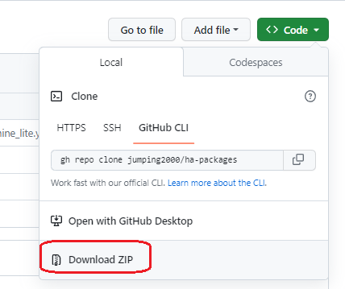

## Versione attuale: 

<b>Se ti piacciono i packages lascia una 🌟 su Github!</b>

| 📡 Elettrodomestici Smart 📶| Versione
| :---: | --- |
| [Lavatrice 💧](lavatrice.md)|**RELEASED in 2023.4.2**|
| [Lavastoviglie 🍽](lavastoviglie.md)|**RELEASED in 2023.5.1**| 
| [Forno 👨‍🍳](forno.md)|**RELEASED in 2023.4.5**|
| [Asciugatrice 🌀](asciugatrice.md)|**RELEASED in 2023.9.0**| 
| [Inverter ☀](#inverter)|NOT YET RELEASED| 
| [Condizionatore 🌪](#condizionatore)|NOT YET RELEASED|
| [Termostato 🔥](#termostato)|NOT YET RELEASED|
| [Router 📶](network.md)|**RELEASED in 2023.8.0**|

## Download ZIP with all Home Assistant Project!

<table>
	<tr>
	    <th>
 🖥 Download 🖥
</th>
	</tr>
  <tr>
      <td></td>
  </tr>
</table>

