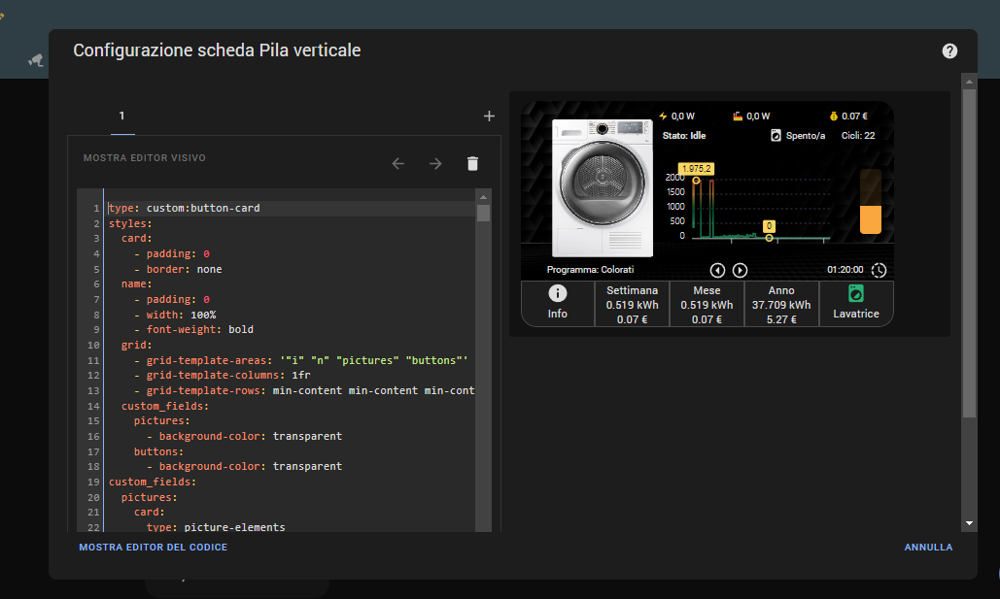

$$\textbf{\color{lightgreen} \huge 🌪 Asciugatrice 💦}$$

<p align="center"> 🔥 <b>Pacchetto AUTO CONFIGURANTE</b> 🔥 </p>

| Sommario |
| :---: |
| [Introduzione](#introduzione) |
| [Prerequisiti](#prerequisiti) | 
| [Dispositivi](#dispositivi) | 
| [Funzionamento](#funzionamento) | 
| [User interface](#user-interface) |
| [Installazione](#installazione) | 
| [Configurazione](#configurazione) |
| [Conclusioni](#conclusioni) |

**Paragrafi obbligatori:**
- [x] [Prerequisiti](#prerequisiti)
- [x] [Installazione](#installazione)
- [x] [Configurazione](#configurazione)

<br>

|  |  |
| :---: | --- |
| Livello | Novizio (Novizio, Esperto, Pro) |
| Difficoltà | Bassa (Bassa, Media, Alta) |

<br>

**Ti piace questo package? Lascia una stella su Github e supportami per realizzarne altri!** <a href="https://www.buymeacoffee.com/jumping"></a>

[![Websitebadge]][website] [![Forum][forumbadge]][forum] [![telegrambadge]][telegram] [![facebookbadge]][facebook] 

## Introduzione

L'articolo riprende quanto avevamo già scritto nel 2020 con l'articolo **[Elettrodomestici Smart](https://hassiohelp.eu/2020/04/05/elettrodomestici-smart-con-home-assistant/)** che ha introdotto:
1. un package per poter monitorare lo stato degli elettrodomestici non smart utilizzando una presa o dispositivo in grado di effettuare delle misurazione dei livelli di potenza, 
2. una card Lovelace con effetti grafici CSS ed informazioni di funzionamento. 

In particolare in questa **edizione 2023** useremo alcuni custom ricchi di funzionalità come [Button Card](https://github.com/custom-cards/button-card) ed [ApexChart Card](https://github.com/RomRider/apexcharts-card) che oramai sono diventati dei veri e propri classici delle interfacce sviluppate per Home Assistant e introdurremo ulteriori elementi sia a livello di dati disponibili che a livello di grafica, ma le perle che rendono l'uso del package veramente superiore sotto tutti punti di vista rispetto a pacchetti analoghi sono:
* l'utilizzo di una "macchina a stati finiti" [FSM](https://it.wikipedia.org/wiki/Automa_a_stati_finiti) che restituisce lo stato del dispositivo in maniera molto precisa. 
* Un [Blueprint](https://www.home-assistant.io/docs/automation/using_blueprints/) semplificherà la configurazione e contemporaneamente darà ottima precisione nella rilevazione delle fasi di asciugatura.
* **🔥E novità assoluta, il tutto sarà auto-configurante senza necessità di scrivere neanche una riga di YAML** 🔥

Riepiloghiamo i punti di forza di questo pacchetto sono:
1. Adattabile per l'uso su tablet, smartphone, PC;
2. Macchina a stati finiti per ricavare lo stato della asciugatrice;
3. Utilizzo di codice YAML non obsoleto e riduzioni del "codice inutile";
4. Versioni grafica unificata per dashboard "_yaml_" e "_storage_", vedi [Dashboard](https://www.home-assistant.io/dashboards/dashboards/);
5. Riduzione del numero di componenti custom necessari;
6. Utilizzo dei dati statistici conservati nel DB di HA senza quindi richiedere uan retention "_infinita_" o cmq molto estesa del DB stesso;


$$\textbf{\color{red} \normalsize 🚨 Come usuale prestate massima attenzione ai collegamenti elettrici. 🚨}$$


## Prerequisiti 

Per poter utilizzare il packages occorrono alcune card e alcune configurazioni abbastanza comuni, le card e i custom sono disponibili sul community store [HACS](https://hacs.xyz/) , sul sito [HassioHelp.eu](https://hassiohelp.eu) sono presenti numerose guide, prestate particolare attenzione alla data di rilascio della guida, alcune sono datate e potrebbero essere da ricontrollare, in questo caso il gruppo Telegram [HassioHelp](https://t.me/HassioHelp) è un validissimo aiuto.

| Card/Custom | Uso |
| :---: | --- |
| **[Button Card](https://github.com/custom-cards/button-card)** | Obbligatorio |
| **[ApexChart Card](https://github.com/RomRider/apexcharts-card)** | Obbligatorio |
| **[Browser Mod](https://github.com/thomasloven/hass-browser_mod)** | Obbligatorio |
| **[Card Mod](https://github.com/thomasloven/lovelace-card-mod)** | Obbligatorio |
| **[Layout Card](https://github.com/thomasloven/lovelace-layout-card)** | Usato ma non indispensabile |
| **[Bar Card](https://github.com/custom-cards/bar-card)** | Usato ma non indispensabile |
| **[Multiple Entity Row](https://github.com/benct/lovelace-multiple-entity-row)** | Usato ma non indispensabile |

L'utilizzo delle card _non indispensabili_ permette una migliore visualizzazione delle informazioni soprattutto con i dispositivi smartphone ma nulla vieta di poterle rimuovere utilizzando dei layout più scomodi ma comunque fruibili (questo vale per la Layout Card e la Multiple Entity Row). La rimozione dei card custom e dl relativo adattamento del codice YAML è lasciato al lettore "evoluto" in grado di procedere in autonomia.

| Configurazioni obbligatorie |
| :---: |

Per poter procedere con l'installazione del package ci sono alcuni passi da effettuare:
* abilitare i packages come descritto qui: [Packages](https://www.home-assistant.io/docs/configuration/packages/);
* configurare Home Assistant per avere i sensori di tempo e di data come spiegato qui: [Time & Date](https://www.home-assistant.io/integrations/time_date/) o nelle guide [HassioHelp](https://hassiohelp.eu);
* impostazione dei servizi di notifica: ad esempio [Telegram](https://www.home-assistant.io/integrations/telegram/), [Google](https://www.home-assistant.io/integrations/google_assistant/), [Mobile App](https://companion.home-assistant.io/) la scelta migliore rimane sempre l'uso del [Centro Notifiche](https://github.com/caiosweet/Package-Notification-HUB-AppDaemon) che centralizza la configurazione di tutti i servizi di notifica.
* configurare il ***blueprint*** ad hoc.

| Guide Hassiohelp |
| :---: |

Ecco alcune guide pubblicate da [HassioHelp.eu](https://hassiohelp.eu) che sicuramente sono meno aggiornate della documentazione ufficiale ma restano valide: 
* [Packages](https://hassiohelp.eu/2018/11/30/package-configurazione/)
* [ESPHome](https://hassiohelp.eu/2019/06/09/esphome/)
* [HACS](https://hassiohelp.eu/2019/10/06/hacs-guida-allinstallazione/)
* [Google](https://hassiohelp.eu/2018/11/29/google-home/)
* [Alexa](https://hassiohelp.eu/2019/12/11/alexa-su-home-assistant-gratis/)
* [Centro Notifiche](https://hassiohelp.eu/2020/11/09/centro-notifiche-3-0-appdaemon/)
* [Animazioni CSS](https://hassiohelp.eu/2020/04/09/css-lovelace/)

## Dispositivi

E' fondamentale avere una presa, o un relay “smart” (come la famiglia Shelly PM) o altro sistema smart basato su pinza amperometrica come Shelly EM o PZEM che restituisca la ***potenza assorbita in watt/Kw***  dall'asciugatrice. 

## Funzionamento

L’idea alla base dell'articolo è che grazie alle informazioni di potenza restituite dalla presa smart siamo in grado di capire in che stato si trova il nostro elettrodomestico e quindi possiamo costruire una serie di sensori che diano delle informazioni da visualizzare nella UI di Home Assistant o piuttosto per avvertirci quando stendere i panni tramite un servizio di notifica.

Vediamo in dettaglio quali sono gli stati per l'asciugatrice, le transizioni da uno stato ad un altro sono guidate dalla potenza assorbita dall'asciugatrice stessa e dal tempo di permanenza nello stato:

| Stato | Caratteristiche |
| :---: | --- |
| **Idle** | Stato iniziale a riposo della asciugatrice | 
| **Asciugatura** | Avvio del programma di asciugatura dei panni |
| **Mantenimento** | Fase di mantenimento a bassa potenza |
| **Svuotare** | Stato finale del programma di asciugatura |

<br>

Anche chi possiede una asciugatrice smart che espone in HA lo stato dell'elettrodomestico potrà utilizzare il package adattando il codice ai dati esposti dall'integrazione smart.

---

Il package e la relativa card espongono una serie di dati, funzionalità, grafici, proviamo a riassumerle:

**Dati**

* Dati giornalieri, settimanali, mensili ed annuali di energia (kWh) consumata e relativo costo in €
* Numero dei cicli giornalieri, settimanali, mensili ed annuali di asciugatura effettuati 
* Durata dei cicli giornalieri, settimanali, mensili ed annuali di asciugatura effettuati
* Numero e durata totale dei cicli effettuati
* Durata, energia e costo dell'ultimo asciugatura

**Grafici**

* Grafico X-Y della potenza consumata
* Grafico a barre dei cicli di funzionamento per programmare la manutenzione
* Grafico a istogramma dell'energia consumata negli ultimi 30 giorni
* Grafico a barre per corrente, tensione, potenza attiva, apparente e reattiva se restituiti dalla presa smart o altro sistema di misura.

**Funzionalità presenti**

* Timer con vari programmi asciugatrice per tenere sotto controllo il tempo trascorso
* Notifiche per i cambi di stato


***Altra funzionalità innovativa del package è l'uso delle funzionalità di esposizione dei dati statistici delle card standard Lovelace e Apex senza quindi incidere nelle dimensioni del DB***, il `recorder` può quindi rimanere configurato con i classici 5-10 giorni di memorizzazione dei dati ma è possibile visualizzare i dati di energia consumata degli ultimi 30 giorni o più se uno desidera.

<br>

$$\textbf{\color{red} \normalsize NOTA BENE} $$

**Il package è piuttosto generale quindi è possibile che alcuni dispositivi espongano tramite integrazione certe entità e non altre, occorre un po' di buon senso e cancellare le parti YAML non necessarie.**

## User Interface

<table align="center">
	<tr>
	  <th><center> 🖥 Desktop 🖥<center></th>
      <th><center>📱 Mobile 🔋<center></th>
	</tr>
    <tr>
      <td><div align=center></div></td>
      <td><div align=center></div></td>
    </tr>
</table>

La card è, in sostanza, una _custom button-card_ con funzionalità di _container_ che al suo interno contiene due importanti sezioni:
* la _parte superiore_ è costituita da una _picture-elements card_
* la _parte inferiore_ è costituita da una fila orizzontale di 5 bottoni a loro volta realizzati con _custom button-card_

La ***picture-elements*** card ha la funzione di _contenitore_ sia per elementi grafici che informazioni testuali:
* **sulla parte sinistra** è presente l'immagine grafica dell'asciugatrice, i CSS presenti nella configurazione fanno in modo che ad ogni stato corrisponda una animazione.
* **nella parte centrale** è collocato il grafico della potenza assorbita dalla asciugatrice.
* **nella parte destra** è presente il grafico a barre dei cicli di asciugatura che indica quanti cicli sono stati effettuati e dove il 100% rappresenta il numero di cicli dopo il quale è  necessario effettuare una manutenzione.
* **in alto a destra** troviamo le informazioni testuali relative ad energia, potenza, stato, n° cicli.
* **in basso** sotto l'immagine dell'asciugatrice è presente la scelta del programma dell'asciugatrice con il tempo rimasto.

La sezione orizzontale di bottoni in basso ("***button container***") presenta le seguenti informazioni:

| Bottone | Cosa fa |
| :---: | --- |
| **Info** | cliccando si apre una finestra con le informazioni di dettaglio relative alla consumi/cicli/costi per giorno, settimana, mese, anno ed aspetti di configurazione |
| **Settimana** / **Mese** / **Anno** |informazioni relative all'energia consumata e i costi associati |
| **Asciugatrice** | bottone che con il tocco singolo spegne/accende la presa collegata all'elettrodomestico, con il tocco prolungato apre la finestra con i dati e i grafici di energia recuperati dalle informazioni statistiche contenute nel DB di HA |

Come detto la card è adattabile al dispositivo usato e al suo orientamento, non si tratta una card _responsive_ ma si è cercato di rendere la fruizione buona sia su smartphone che su PC o tablet.

<table align="center">
	<tr>
	    <th><center>🎫 Info Card 🎫</center></th>
      <th><center>⬆ Energy Card ⬇</th>
	</tr>
    <tr>
        <td><div align=center></div></td>
        <td><div align=center></div></td>
    </tr>
</table>


## Installazione
| Download |
| :---: |

[Github](https://github.com/jumping2000/ha-packages/tree/main/elettrodomestici_2023) permette di effettuare il completo download dei file che costituiscono il pacchetto, quindi file yaml e immagini. Basta cliccare sul pulsante "verde" e si scaricherà un file zip con tutti i packages presenti. In alternativa per i packages relativi ad **Elettrodomestici Smart 2023** è possibile effettuare il download per "release": [Release Download](https://github.com/jumping2000/ha-packages/releases)

<br>
<table align="center">
	<tr>
	    <th><center>🎫 Github Download 🎫</center></th>
        <th><center>🎫 Release Download 🎫</center></th>
	</tr>
  <tr>
      <td><div align=center></div></td>
      <td><div align=center></div></td>
  </tr>
</table>


| Struttura dei file |
| :---: |

La struttura dei file è rappresentata di seguito, quindi occorre **rispettare la posizione dei file nel filesystem come da schema sottostante**, in alternativa l'utente esperto può riposizionare i files nella maniera che più preferisce. 

La card Lovelace è unica ed è disponibile sia per chi usa la modalità [YAML o storage](https://www.home-assistant.io/dashboards/dashboards/) (***card_asciugatrice.yaml***).

**NOTA**:
Saranno presenti due cartelle _autoconfig_, una per PC (_autoconfig_x86_64_) e una per Raspberry (_autoconfig_rpi_).


```bash
.
├── addons/
├── backup/
│
├── config/
│   │
│   ├── lovelace/
│   │   └── card_elettrodomestici/
│   │       └── card_asciugatrice.yaml
|   |
│   ├── packages/
│   │   ├── autoconfig/
│   │   │   ├── pyarmor_runtime_000000/
│   │   │   └─── auto_config.py
│   │   ├── keys.txt
│   │   └── elettrodomestici/
│   │       └── dryer.yaml
│   │
│   ├── www/
│   │   └── hassiohelp/
│   │       └── pkg_elettrodomestici/
│   │           ├── asciugatrice.png
│   │           ├── asciugatrice_oblo.png
│   │           ├── asciugatrice_cornice.png
│   │           ├── asciugatrice_panni.png
│   │           ├── sfondo_black.png
│   │           ├── sfondo_white.png
│   │           ├── sfondo_gray.png
│   │           └── sfondo_gray2.png
│   │ 
│   ├── home-assistant.log
│   └── secret.yaml
├── share/
└── ssl/
```

## Configurazione
| Blueprint |
| :---: |

Lanciare il blueprint [CN FSM ](https://github.com/jumping2000/ha-templates/tree/main/blueprints/cn_fsm):
* impostare le entità richieste relative all'integrazione FritzBox;
* impostare le modalità di notifica, il blueprint funziona sia con il ***Centro Notifiche*** che senza;
* nel link precedente trovi la descrizione delle funzionalità offerte.

[](https://my.home-assistant.io/redirect/blueprint_import/?blueprint_url=https%3A%2F%2Fgithub.com%2Fjumping2000%2Fha-templates%2Fblob%2Fmain%2Fblueprints%2Fcn_fsm%2Fcn_fsm_appliances.yaml)


Nel blueprint occorre indicare i sensori relativi a potenza ed energia, i servizi di notifica, alcuni helper e le entità relative allo stato dell'asciugatrice che nel package sono i seguenti, anche se poi ogni utilizzatore  è libero di cambiarli:
* `input_select.dryer_status`
* `sensor.dryer_status`
* `input_boolean.asciugatrice_runtime`
* `input_number.asciugatrice_energia_iniziale`
* `counter.cicli_asciugatrice`

<br>

| Impostazioni Package |
| :---: |

I passi di configurazione per poter utilizzare questo package, sono veramente pochi grazie allo script auto-configurante:
* scaricare i files necessari e inserirli nelle cartelle di HA come previsto nel paragrafo "_Struttura dei file_", in particolare:
  * la cartella _autoconfig_ e _keys_network.txt_ in _packages_
  * _dryer.yaml_ in _packages/elettrodomestici_
  * _card_asciugatrice.yaml_ in _lovelace/card_elettrodomestici_
* rinominare _keys_dryier.txt_ in _keys.txt_ (**IMPORTANTE**)
* lanciare lo script di configurazione _auto_config.py_ attraverso la CLI (Command Line Interface) messa a disposizione dall'[addon SSH](https://github.com/hassio-addons/addon-ssh) oppure da CLI del container di Home Assistant (*ATTENZIONE* l'addon core-ssh non è adatto, occorre usare obbligatoriamente l'addon nel link):

**NOTA:** Se non riesci a lanciare i comandi sottostanti dal'addon SSH, utilizza nella conf dell'addon l'username ***root***, potrai ripristinare il precedente username alla fine della configurazione.

```bash

/config/packages# chmod 744 autoconfig_x86_64/auto_config.py
/config/packages# python autoconfig_x86_64/auto_config.py -v

```

oppure per Raspberry:

```bash
/config/packages# chmod 744 autoconfig_rpi/auto_config.py
/config/packages# python autoconfig_rpi/auto_config.py -v

```

dove ***/config/packages#*** è il path all'interno del filesystem del container.

<br>

* verificare che l'operazione sia andata a buon fine e lo script abbia effettuato le sostituzioni;
* controllare package e card con un editor di testo e verificare che non ci siano tag "**ENTITA' NON NEL BLUEPRINT**", che può indicare 2 cose:
  * hai dimenticato di inserire nel blueprint delle entità necessarie;
  * ci sono delle entità da cancellare poichè non significative nella tua configurazione;
* finiti questi passaggi inserire la card router o nella propria configurazione Lovelace in YAML oppure nella propria interfaccia costruita tramite UI come di seguito riportato;
* riavviare Home Assistant;
* dopo il riavvio di HA controllare che non ci siano _errori nel log_.

***Avvertenze***: 
1. ricordarsi di effettuare l'avvio dello script subito dopo il completamento del blueprint;
2. lo script va lanciato una sola volta sui file yaml scaricati da Github, se sbagli qualcosa occorre effetture il download di nuovo;
2. se per qualche motivo avete cambiato o volete cambiare i percorsi standard è possibile utilizzare delle opzioni nella sintassi dello script:
    * ***-a*** : per cambiare il percorso completo del file _automations.yaml_
    * ***-c*** : per variare il percorso completo della card
    * ***-p*** : per variare il percorso completo del package
    * ***-k*** : per variare il percorso completo del file _keys.txt_

| Lovelace - Storage |
| :---: |

Chi usa questa modalità potrà caricare l'intero file di configurazione dell'interfaccia grafica nella UI, ***dopo aver completato i passi precedenti***, e variare sempre da UI gli aspetti che più interessano.

<br>

<table align="center">
	<tr>
	    <th><center>🚀 Modalità UI storage 🚀</center></th>
	</tr>
  <tr>
      <td><div align=center></div></td>
  </tr>
</table>

Per quanto riguarda le impostazioni grafiche è possibile agire sul proprio "tema" del [Frontend](https://www.home-assistant.io/integrations/frontend/) oppure scegliere tra i vari **sfondi presenti** e su alcuni parametri relativi alla parte inferiore realizzata con button-card, in particolare:
1. raggio del bordo
2. colore del bordo
3. colore di background
4. altezza dei button inferiori

<br>

| Alcune considerazioni |
| :---: |

Il diagramma FSM realizzato dal ***blueprint*** é il seguente.

<br>


<br>
Per quanto riguarda lo script python, esso effettua una serie di operazioni di _"ricerca e sostituzione"_ all'interno del container, quindi il suo utilizzo è assolutamente sicuro: nel caso di problemi basterà cancellare lo script e riavviare HA. 

## Conclusioni
Con questo package abbiamo visto come combinare insieme diversi elementi:
* un blueprint per semplificare la configurazione
* una grafica accattivante con alcuni effetti visuali.
* un uso moderno dei dati statistici di HA
* **la grande novità della funzionalità di auto-configurazione!!**

Il risultato sembra piacevole, lasciate pure le vostre impressioni sui nostri canali social.

| Ispirazione e ringraziamenti |
| :---: |

L'idea alla base di questo package è sempre l'ottimo lavoro di [Phil Hawthorne](https://philhawthorne.com/making-dumb-dishwashers-and-washing-machines-smart-alerts-when-the-dishes-and-clothes-are-cleaned/) del 2017 ma sempre fonte di ispirazioni per tutti i lavori di questo tipo. Per la parte FSM realizzata con blueprint esiste una buona discussion nel forum di [HA](https://community.home-assistant.io/t/detect-and-monitor-the-state-of-an-appliance-based-on-its-power-consumption-v2-1-1-updated/421670).
Per la parte FSM in ESPHOME Mikhail Diatchenko ha realizzato un ottimo componente: [ESPHome State Machine](https://github.com/muxa/esphome-state-machine).

Tutti i  nostri "follower" 😄

| Supporto |
| :---: |

**Ti piace questo package? Lascia una ⭐ su Github e supportami per realizzarne altri!** <a href="https://www.buymeacoffee.com/jumping"></a>

[![Websitebadge]][website] [![Forum][forumbadge]][forum] [![telegrambadge]][telegram] [![facebookbadge]][facebook] 

<!-- ✨ _special_ ✨ -->
[website]: https://hassiohelp.eu/
[Websitebadge]: https://img.shields.io/website?down_message=Offline&label=HassioHelp&logoColor=blue&up_message=Online&url=https%3A%2F%2Fhassiohelp.eu

[telegram]: https://t.me/HassioHelp
[telegrambadge]: https://img.shields.io/badge/Chat-Telegram-blue?logo=Telegram

[facebook]: https://www.facebook.com/groups/2062381507393179/
[facebookbadge]: https://img.shields.io/badge/Group-Facebook-blue?logo=Facebook

[forum]: https://forum.hassiohelp.eu/
[forumbadge]: https://img.shields.io/badge/HassioHelp-Forum-blue?logo=data:image/png;base64,iVBORw0KGgoAAAANSUhEUgAAABgAAAAYCAYAAADgdz34AAAAGXRFWHRTb2Z0d2FyZQBBZG9iZSBJbWFnZVJlYWR5ccllPAAAA0ppVFh0WE1MOmNvbS5hZG9iZS54bXAAAAAAADw/eHBhY2tldCBiZWdpbj0i77u/IiBpZD0iVzVNME1wQ2VoaUh6cmVTek5UY3prYzlkIj8%2BIDx4OnhtcG1ldGEgeG1sbnM6eD0iYWRvYmU6bnM6bWV0YS8iIHg6eG1wdGs9IkFkb2JlIFhNUCBDb3JlIDUuNS1jMDIxIDc5LjE1NTc3MiwgMjAxNC8wMS8xMy0xOTo0NDowMCAgICAgICAgIj4gPHJkZjpSREYgeG1sbnM6cmRmPSJodHRwOi8vd3d3LnczLm9yZy8xOTk5LzAyLzIyLXJkZi1zeW50YXgtbnMjIj4gPHJkZjpEZXNjcmlwdGlvbiByZGY6YWJvdXQ9IiIgeG1sbnM6eG1wTU09Imh0dHA6Ly9ucy5hZG9iZS5jb20veGFwLzEuMC9tbS8iIHhtbG5zOnN0UmVmPSJodHRwOi8vbnMuYWRvYmUuY29tL3hhcC8xLjAvc1R5cGUvUmVzb3VyY2VSZWYjIiB4bWxuczp4bXA9Imh0dHA6Ly9ucy5hZG9iZS5jb20veGFwLzEuMC8iIHhtcE1NOkRvY3VtZW50SUQ9InhtcC5kaWQ6ODcxMjY2QzY5RUIzMTFFQUEwREVGQzE4OTI4Njk5NDkiIHhtcE1NOkluc3RhbmNlSUQ9InhtcC5paWQ6ODcxMjY2QzU5RUIzMTFFQUEwREVGQzE4OTI4Njk5NDkiIHhtcDpDcmVhdG9yVG9vbD0iQWRvYmUgUGhvdG9zaG9wIENDIDIwMTQgKFdpbmRvd3MpIj4gPHhtcE1NOkRlcml2ZWRGcm9tIHN0UmVmOmluc3RhbmNlSUQ9ImFkb2JlOmRvY2lkOnBob3Rvc2hvcDo0MWVhZDAwNC05ZWFmLTExZWEtOGY3ZS1mNzQ3Zjc1MjgyNGIiIHN0UmVmOmRvY3VtZW50SUQ9ImFkb2JlOmRvY2lkOnBob3Rvc2hvcDo0MWVhZDAwNC05ZWFmLTExZWEtOGY3ZS1mNzQ3Zjc1MjgyNGIiLz4gPC9yZGY6RGVzY3JpcHRpb24%2BIDwvcmRmOlJERj4gPC94OnhtcG1ldGE%2BIDw/eHBhY2tldCBlbmQ9InIiPz4xQPr3AAADq0lEQVR42rRVW2wMURj%2Bz5lL7V27KG26KIuUEJemdalu3VN3Ei/ipSWUuIV4FB4kHrwo8VLRROJBgkYElZCi4olG4rVoROOSbTa0u7pzO/6Z2Zmd3Z2uevBn/8zsf/7zff/tnKGMMRi/pjM6/j08oKiqCm1tbTA4OAhuoqkS8KKPVjceOcgJngkfnl%2B5JiWH0pQvcfUPhULQ0dEBPp8PDBZZlqGyshLGFKG0fHHr/QfNlxnbjFp7uOcl8VVVj%2BXu9XohkUgY2NRpdJMpc5qWN5971zu7ftsWkSAX2iKLYg3NZ/t6Kxbu2Oi2x4g8IxSKSDR2tLXh2JOn3nAkKv9GAzPtyigS%2BSdV1B3sejhv09lTxTBcCXjRK9buu96%2BZG/7dUYEryK59EXWewNcza7zl%2Br237kpessC4yIITIlGGk88666OtR6VMFKmZhZY9sGsdw1ATgFU1O7et%2Brki56JVUtqsl4kl0CVUjB57vo1Tad7X4Wj9U1S0vRj8HfRSQKVC5auPN7zctqiPTs1Rz2pBV6xcOuq%2BkOPusVAeZWxDg5wl%2Bhz1vW%2BpBFMDIYXt9y%2BF6lr2a6kR7IEmipDeFYsRkVewFcTyAXcBtNMhTxCTTErUxZdu96qLW8varhFsyrnQCQOYNXU8qBp//4TH/jkHZ3UCTXFoncQGKciP1SiN1JDVY2IJwgEjq3jYMVsZgC/HSBw9RnA8CgBjmS3MkdefE638sCV0WGQk9/QXYNRicH%2B7eWwYUGpOT4oq%2Bfq0Upw4SEPVOCLnwOWp5o%2BgskfWEoZe8Qg6CGwcp7XWFVxTc0UYdlMrLmQsP8zVuQcWFNiORFCTSvRQTWQs6W101SRXE7/xiDSBeC5BKywRLx/KqbuA44TYUQS4HHfsLHEcZyhulP32zjEUwL2ACuPt24%2BR0HhnONJBA8IoRlG/4P4/%2B57FTTyC9bUMAQk8OJ9Am69VsHjC2cOJbPaU0iQn4DxrjnSwVwp4eF2XwC63uBVLCchpXgQPAiUUrM8xBwlfeqs%2Bc7JwFn//KHKtAI8IkVejFgIgY8p2etEB7cPDbF32wSE8pwx926XTx6pAcPxxmFlzIo2o/qPy84sb4JTSMb7v3qiGFhJIaAzw1wbkmh8tu4IrqKm4v347V1qmvQGKvjJjEyf7v/pX3GmrGp%2BtT73UDyRHCPLMBDKwUj801dl4P7Fwc8fh0rLwiaBrp2dN2Do%2Bxfb%2Bd%2BE2GwEe%2BEPTYaW1gNQUiKaBP9T/ggwAJik5dEKYSC3AAAAAElFTkSuQmCC