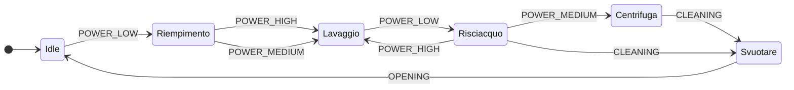
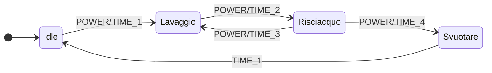

# 🌊 Lavatrice smart 💧


| Sommario |
| :---: |
| [Introduzione](#introduzione) |
| [Prerequisiti](#prerequisiti) | 
| [Dispositivi](#dispositivi) | 
| [Funzionamento](#funzionamento) | 
| [User interface](#user-interface) |
| [Installazione](#installazione) | 
| [Configurazione](#configurazione) |
| [Conclusioni](#conclusioni) |

**Paragrafi obbligatori:**
- [x] [Prerequisiti](#prerequisiti)
- [x] [Installazione](#installazione)
- [x] [Configurazione](#configurazione)


**Ti piace questo package? Lascia una stella su Github e supportami per realizzarne altri!** <a href="https://www.buymeacoffee.com/jumping"></a>

[![Websitebadge]][website] [![Forum][forumbadge]][forum] [![telegrambadge]][telegram] [![facebookbadge]][facebook] 

## Introduzione

L'articolo riprende quanto avevamo già scritto nel 2020 con l'articolo **[Elettrodomestici Smart](https://hassiohelp.eu/2020/04/05/elettrodomestici-smart-con-home-assistant/)** che ha introdotto:
1. un package per poter monitorare lo stato degli elettrodomestici non smart utilizzando una presa o dispositivo in grado di effettuare delle misurazione dei livelli di potenza, 
2. una card Lovelace con effetti grafici CSS ed informazioni di funzionamento. 

In particolare in questa **edizione 2023** useremo alcuni custom ricchi di funzionalità come [Button Card](https://github.com/custom-cards/button-card) ed [ApexChart Card](https://github.com/RomRider/apexcharts-card) che oramai sono diventati dei veri e propri classici delle interfacce sviluppate per Home Assistant e introdurremo ulteriori elementi sia a livello di dati disponibili che a livello di grafica, ma la perla che rende l'uso del package veramente superiore sotto tutti punti di vista rispetto a pacchetti analoghi, è l'utilizzo di una "macchina a stati finiti" [FSM](https://it.wikipedia.org/wiki/Automa_a_stati_finiti) sviluppata in ESPHome che restituisce lo stato del dispositivo in maniera molto precisa. Ovviamente è disponibile anche la versione _lite_ per chi non vuole cimentarsi nella configurazione ESPHOME della presa smart ed utilizzare i dati messi a disposizione dalla presa. In questo caso un fantastico [Blueprint](https://www.home-assistant.io/docs/automation/using_blueprints/) semplificherà la configurazione e contemporaneamente darà ottima precisione nella rilevazione delle fasi.

Riepiloghiamo i punti di forza di questo pacchetto sono:
1. Adattabile per l'uso su tablet, smartphone, PC;
2. Macchina a stati finiti _ESPHOME_ o _lite_ per ricavare lo stato della lavatrice;
3. Utilizzo di codice YAML non obsoleto e riduzioni del "codice inutile";
4. Uso estensivo degli "_anchor_" per centralizzare le parti YAML da personalizzare nel package e nella GUI;
5. Versioni grafica per dashboard "_yaml_" e la traccia per usare la dashboard "_storage_", vedi [Dashboard](https://www.home-assistant.io/dashboards/dashboards/);
6. Riduzione del numero di componenti custom necessari;
7. Utilizzo dei dati statistici conservati nel DB di HA senza quindi richiedere uan retention "_infinita_" o cmq molto estesa del DB stesso;

<span style="color:red">**🚨 Come usuale prestate attenzione a collegare la vostra lavatrice ad un dispositivo smart che sia in grado di supportarne il carico, purtroppo gli incidenti domestici sono sempre dietro l'angolo. 🚨**</span>

## Prerequisiti 

Per poter utilizzare il packages occorrono alcune card e alcune configurazioni abbastanza comuni, le card e i custom sono disponibili sul community store [HACS](https://hacs.xyz/) , sul sito [HassioHelp.eu](https://hassiohelp.eu) sono presenti numerose guide, prestate particolare attenzione alla data di rilascio della guida, alcune sono datate e potrebbero essere da ricontrollare, in questo caso il gruppo Telegram [HassioHelp](https://t.me/HassioHelp) è un validissimo aiuto.

| Card/Custom | Uso |
| :---: | --- |
| **[Button Card](https://github.com/custom-cards/button-card)** | Obbligatorio |
| **[ApexChart Card](https://github.com/RomRider/apexcharts-card)** | Obbligatorio |
| **[Browser Mod](https://github.com/thomasloven/hass-browser_mod)** | Obbligatorio |
| **[Card Mod](https://github.com/thomasloven/lovelace-card-mod)** | Obbligatorio |
| **[Layout Card](https://github.com/thomasloven/lovelace-layout-card)** | Usato ma non indispensabile |
| **[Bar Card](https://github.com/custom-cards/bar-card)** | Usato ma non indispensabile |
| **[Multiple Entity Row](https://github.com/benct/lovelace-multiple-entity-row)** | Usato ma non indispensabile |

L'utilizzo delle card _non indispensabili_ permette una migliore visualizzazione delle informazioni soprattutto con i dispositivi smartphone ma nulla vieta di poterle rimuovere utilizzando dei layout più scomodi ma comunque fruibili (questo vale per la Layout Card e la Multiple Entity Row). La rimozione dei componenti custom e dl relativo adattamento del codice YAML è lasciato al lettore "evoluto" in grado di procedere in autonomia.

| Configurazioni obbligatorie |
| :---: |

Per poter procedere con l'installazione del package ci sono alcuni passi da effettuare:
* abilitare i packages come descritto qui: [Packages](https://www.home-assistant.io/docs/configuration/packages/);
* configurare Home Assistant per avere i sensori di tempo e di data come spiegato qui: [Time & Date](https://www.home-assistant.io/integrations/time_date/) o nelle guide [HassioHelp](https://hassiohelp.eu);
* configurare il sensore che restituisce il costo dell'energia (a breve ci sarà package accessorio ad hoc) scegliendo tra un sensore che recupera direttamente il PUN oppure un helper input_number configurabile;
* impostazione dei servizi di notifica: ad esempio [Telegram](https://www.home-assistant.io/integrations/telegram/), [Google](https://www.home-assistant.io/integrations/google_assistant/), [Mobile App](https://companion.home-assistant.io/) la scelta migliore rimane sempre l'uso del [Centro Notifiche](https://github.com/caiosweet/Package-Notification-HUB-AppDaemon) che centralizza la configurazione di tutti i servizi di notifica.
* per la versione _lite_ configurare il blueprint ad hoc.

| Guide HassioHelp |
| :---: |

Ecco alcune guide pubblicate da [HassioHelp.eu](https://hassiohelp.eu) che sicuramente sono meno aggiornate della documentazione ufficiale ma restano valide: 
* [Packages](https://hassiohelp.eu/2018/11/30/package-configurazione/)
* [ESPHome](https://hassiohelp.eu/2019/06/09/esphome/)
* [HACS](https://hassiohelp.eu/2019/10/06/hacs-guida-allinstallazione/)
* [Google](https://hassiohelp.eu/2018/11/29/google-home/)
* [Alexa](https://hassiohelp.eu/2019/12/11/alexa-su-home-assistant-gratis/)
* [Blitwolf WiFi Plug](https://hassiohelp.eu/2019/11/06/blitzwolf-bw-shp6/)
* [Shelly 1PM](https://hassiohelp.eu/2019/10/31/shelly-1pm/)
* [Shelly EM](https://hassiohelp.eu/2020/01/13/shelly-em/)
* [PZEM 004T](https://hassiohelp.eu/2019/01/02/consumi-pzem/)
* [PZEM 016](https://hassiohelp.eu/2019/03/27/pzem-016/)
* [Centro Notifiche](https://hassiohelp.eu/2020/11/09/centro-notifiche-3-0-appdaemon/)
* [Animazioni CSS](https://hassiohelp.eu/2020/04/09/css-lovelace/)


## Dispositivi

E' fondamentale avere una presa, o un relay “smart” (come la famiglia Shelly PM) o altro sistema smart basato su pinza amperometrica come Shelly EM o PZEM che restituisca la ***potenza assorbita in watt/Kw***  della lavatrice. Per ottenere il massimo risultato ed utilizzare quindi la FSM occorre un dispositivo in grado di essere configurato con il firmware ESPHome, se non è possibile ci sono due alternative:
1. utilizzare una versione ridotta (_lite_) del package;
2. adattare le automazioni già sviluppate nell'articolo del 2020 al proprio caso.

Nel repository su Github sono presenti due packages già pronti per l'uso, la versione ***FSM*** e la versione ***lite***, che utilizza una FSM semplificata e realizzata con un blueprint.

## Funzionamento

L’idea alla base dell'articolo è che grazie alle informazioni di potenza restituite dalla presa smart siamo in grado di capire in che stato si trova il nostro elettrodomestico e quindi possiamo costruire una serie di sensori che diano delle informazioni da visualizzare nella UI di Home Assistant o piuttosto per avvertirci quando stendere i panni tramite un servizio di notifica.

Vediamo in dettaglio quali sono gli stati per la lavatrice, le transizioni da uno stato ad un altro sono guidate dalla potenza assorbita dalla lavatrice stessa e dal tempo di permanenza nello stato:

| Stato | Caratteristiche |
| :---: | --- |
| **Idle** | Stato iniziale a riposo della lavatrice | 
| **Riempimento** | Stato iniziale del lavaggio con il carico dell'acqua |
| **Lavaggio** | Avvio del programma con il riscaldamento dell'acqua e lavaggio dei panni vero e proprio |
| **Risciacquo** | Fase di risciacquo in cui sono eliminati i residui di detersivo |
| **Centrifuga** | Fase di rotazione del cestello ed eliminazione dell'acqua |
| **Svuotare** | Stato finale del programma di lavaggio |

Questo stati sono calcolati nella versione FSM _full esphome_ del package e nella versione _lite_ rispettivamente da:
* FSM implementata nel codice ESPHome e restituita dal sensore Esphome `sensor.washing_machine_status`
* FSM a quattro stati e realizzata con tre semplici automazioni, restituisce il template sensor `sensor.washing_machine_status`

Ovviamente la versione FSM realizzata con ESPHOME sarà più precisa, _se opportunamente configurata con cura con i dati di potenza della propria lavatrice_, perché lo stato della lavatrice dipenderà da un'analisi più fine della potenza assorbita e degli stati. 

Per la versione _lite_ gli stati dell'automa sono quattro, nulla vieta di personalizzare i nomi degli stati andando ad agire sull'apposita entità `input_select`.

| Stato | Caratteristiche |
| :---: | --- |
| **Idle** | Stato iniziale a riposo della lavatrice | 
| **Lavaggio** | Avvio del programma con il riscaldamento dell'acqua e lavaggio dei panni vero e proprio |
| **Risciacquo** | Fase di risciacquo in cui sono eliminati i residui di detersivo |
| **Svuotare** | Stato finale del programma di lavaggio |


<br>

Anche chi possiede una lavatrice smart che espone in HA lo stato dell'elettrodomestico potrà utilizzare il package aggiustando il codice in maniera minimale adattandolo ai dati esposti dall'integrazione smart, vediamo come nel seguente paragrafo.

---

Se l'utente possiede una lavatrice smart è possibile adattare il package e la card Lovelace: il lavoro non è immediato ma modificando opportunamente le principali entità con i dati provenienti dall'integrazione è fattibile.

A titolo di esempio l'integrazione [Home Connect](https://www.home-assistant.io/integrations/home_connect/) Bosch espone alcune tipologie di identità che possono sostituire le principali entità del package, oltre alle entità dei programmi di lavaggio:

| Entità Home Connect| Contenuto | Entità Package |
| :---: | --- | --- | 
| sensor.**lavatrice**_operation_state  | stato operativo | sensor.washing_machine_status |
| sensor.**lavatrice**_remaining_program_time | tempo rimasto | sensor.washing_machine_time_left |
| switch.**lavatrice**_program_auto1 | programma 1 | da esporre nella card |
| switch.**lavatrice**_program_auto2 | programma 2 | da esporre nella card |

---

Il package espone una grande serie di dati, funzionalità, grafici e configurazioni, proviamo a riassumerle:

**Dati**

* Dati giornalieri, settimanali, mensili ed annuali di energia (kWh) consumata e relativo costo in €
* Numero dei cicli giornalieri, settimanali, mensili ed annuali di lavaggio effettuati 
* Durata dei cicli giornalieri, settimanali, mensili ed annuali di lavaggio effettuati
* Numero e durata totale dei cicli effettuati
* Durata, energia e costo dell'ultimo lavaggio

**Grafici**

* Grafico X-Y della potenza consumata
* Grafico a barre dei cicli di funzionamento per programmare la manutenzione
* Grafico a istogramma dell'energia consumata negli ultimi 30 giorni
* Grafico a barre per corrente, tensione, potenza attiva, apparente e reattiva se restituiti dalla presa smart o altro sistema di misura.


**Funzionalità presenti**

* Timer con vari programmi lavatrice per tenere sotto controllo il tempo trascorso
* Integrazione con [Grocy](https://grocy.info/) per tenere traccia delle quantità di detersivo ed ammorbidente utilizzati
* _Actionable Notification_ configurabili con Telegram e Companion app alla fine del ciclo di lavaggio
* Notifiche per i cambi di stato

Per evitare l'uso inutile di entità per configurare alcune aspetti "statici" o comunque poco variabili, relativi al funzionamento, abbiamo preferito usare gli [anchor](https://github.com/thomasloven/hass-config/wiki/Misc-tricks) impostabili nella sezione **"IMPOSTAZIONI DEL PACKAGES"**.
Al contrario gli aspetti di configurazione che sono più soggetti a variazioni sono configurabili dalla card.  Per i **template sensor** sarà comunque necessario personalizzare leggermente il codice visto che non è possibile usare gli anchor, ma in questo caso è chiaramente indicato.

***Altra funzionalità innovativa del package è l'uso delle funzionalità di esposizione dei dati statistici delle card standard Lovelace e Apex senza quindi incidere nelle dimensioni del DB***, il `recorder` può quindi rimanere configurato con i classici 5-10 giorni di memorizzazione dei dati ma è possibile visualizzare i dati di energia consumata degli ultimi 30 giorni o più se uno desidera.

## User Interface

<table align="center">
	<tr>
	    <th>Desktop</th>
      <th>Mobile</th>
	</tr>
    <tr>
        <td><div align=center></div></td>
        <td><div align=center></div></td>
    </tr>
</table>

La card è, in sostanza, una _custom button-card_ con funzionalità di _container_ che al suo interno contiene due importanti sezioni:
* la _parte superiore_ è costituita da una _picture-elements card_
* la _parte inferiore_ è costituita da una fila orizzontale di 5 bottoni a loro volta realizzati con _custom button-card_

La ***picture-elements*** card ha la funzione di _contenitore_ sia per elementi grafici che informazioni testuali:
* **sulla parte sinistra** è presente l'immagine grafica della lavatrice, i CSS presenti nella configurazione fanno in modo che ad ogni stato corrisponda una animazione.
* **nella parte centrale** è collocato il grafico della potenza assorbita dalla lavatrice.
* **nella parte destra** è presente il grafico a barre dei cicli di lavaggio che indica quanti cicli sono stati effettuati e dove il 100% rappresenta il numero di cicli dopo il quale è  necessario effettuare una manutenzione.
* **in alto a destra** troviamo le informazioni testuali relative ad energia, potenza, stato, n° cicli.
* **in basso** sotto l'immagine della lavatrice è presente la scelta del programma della lavatrice con il tempo rimasto.

La sezione orizzontale di bottoni in basso ("***button container***") presenta le seguenti informazioni:
* **Info**: cliccando si apre una finestra con le informazioni di dettaglio relative ai consumi/cicli/costi per giorno, settimana, mese, anno oltre alle durate e cicli totali. Sono inoltre presenti le informazioni relative alla manutenzione da effettuare e la sua configurazione e le impostazioni relative alle notifiche.
* **Settimana** / **Mese** / **Anno**: informazioni relative all'energia consumata e i costi associati.
* **Lavatrice**: bottone che con il tocco singolo spegne/accende la presa collegata all'elettrodomestico, con il tocco prolungato apre la finestra con i dati e i grafici di energia recuperati dalle informazioni statistiche contenute nel DB di HA.

Come detto la card è adattabile al dispositivo usato e al suo orientamento, non si tratta ina card pienamente _responsive_ ma si è cercato di rendere la fruizione buona sia su smartphone che su PC o tablet.

<table align="center">
	<tr>
	    <th><center>🎫 Info Card 🎫</center></th>
      <th><center>☢ Energy Card ☢</th>
	</tr>
    <tr>
        <td><div align=center></div></td>
        <td><div align=center></div></td>
    </tr>
	<tr>
	    <th><center>🌀 Centrifuga in corso 🌀</center></th>
      <th><center>🎽 E' l'ora di tendere i panni 🎽</center></th>
	</tr>
    <tr>
        <td><div align=center></div></td>
        <td><div align=center></div></td>
    </tr>
</table>

## Installazione
| Download |
| :---: |

[Github](https://github.com/jumping2000/ha-packages/elettrodomestici_2023) permette di effettuare il completo download dei file che costituiscono il pacchetto, quindi file yaml e immagini. Una volta inserito tutto nella propria installazione di Home Assistant seguendo le indicazioni presenti nel seguito, occorre seguire i passi base per procedere alla configurazione:
1. Scegliere tra i package in versione _FSM_ o in versione _lite_, l'utente dovrà cancellare i file YAML che non sono di interesse.
2. Scegliere tra la grafica Lovelace in formato _YAML_ o _Storage_, l'utente dovrà cancellare i file YAML che non sono di interesse.
3.  solo per chi usa la versione _lite_, procedere alla configurazione del [Blueprint FSM](https://github.com/jumping2000/ha-templates/tree/main/blueprints/fsm). Qui occorre indicare i sensori relativi a potenza ed energia, i servizi di notifica, alcuni helper e due entità relative allo stato della lavatrice che nel package sono i seguenti, anche se poi ogni utilizzatore  è libero di cambiarli:
    * `input_select.washing_machine_status.yaml`
    * `sensor.washing_machine_status.yaml`
    * `input_boolean.lavatrice_runtime`
    * `input_number.lavatrice_energia_iniziale`
    * `counter.cicli_lavaggio_lavatrice`

| Struttura dei file |
| :---: |

La struttura dei file è rappresentata di seguito, quindi occorre rispettare la posizione dei file nel filesystem come da schema sottostante, in alternativa l'utente esperto può riposizionare i files nella maniera che più preferisce. 
L'unica eccezione è la card Lovelace che può essere posizionata nelle viste - [View Lovelace](https://www.home-assistant.io/dashboards/views/) - già presenti nella propria configurazione.

Per chi usa la modalità *Lovelace YAML* occorre fare in modo che la _custom button-card_ possa utilizzare i templates: quindi bisogna inserire la seguente configurazione in `ui-lovelace.yaml`. Per ulteriori informazioni fate riferimento alla documentazione della card custom [Configuring templates](https://github.com/custom-cards/button-card#configuration-templates).


```yaml
##ui-lovelace.yaml

button_card_templates:
  !include_dir_merge_named button_card_templates
```

Per chi usa la modalità [storage](https://www.home-assistant.io/dashboards/dashboards/) è presente un unico file (**card_lavatrice_storage.yaml**) che include la parte Lovelace.

```bash
.
└── addons/
└── backup/
│
├── config/
│   │
│   ├── button_card_templates/
│   │   └── pkg_elettrodomestici/
│   │       └── button_card_templates.yaml
│   │
|   ├── esphome/
|   │   ├── common/
|   │   │   ├── device_base.yaml
│   │   │   └── secrets.yaml
|   |   └── plug_lavatrice.yaml
│   │
│   ├── lovelace/
│   │   └── card_elettrodomestici/
│   │       ├── lavatrice_button_1.yaml
│   │       ├── lavatrice_button_5.yaml
|   |       ├── card_lavatrice_storage.yaml
│   │       └── card_lavatrice.yaml
|   |
│   ├── packages/
│   │   └── elettrodomestici/
│   │       ├── washing_machine_fsm.yaml
│   │       └── washing_machine_lite.yaml
│   │
│   ├── www/
│   │   └── hassiohelp/
│   │       └── pkg_elettrodomestici/
│   │           ├── lavatrice.png
│   │           ├── lavatrice_oblo.png
│   │           ├── lavatrice_panni.png
│   │           ├── sfondo_black.png
│   │           ├── sfondo_white.png
│   │           ├── sfondo_gray.png
│   │           └── sfondo_gray2.png
│   │ 
│   ├── home-assistant.log
│   └── secret.yaml
└── share/
└── ssl/
```

## Configurazione
| Impostazioni Package |
| :---: |

Nella sezione **"IMPOSTAZIONI DEL PACKAGE"** presente nella parte iniziale nel file _washing_machine_xxx.yaml_ sono da configurare una serie di parametri:
1. servizi di notifica;
2. i dati necessari per il funzionamento come lo switch della presa a cui è collegata la lavatrice o il sensore di potenza.

Per i **servizi di notifica** sono da configurare i seguenti parametri, con le entità corrette:
* _SCRIPT Centro notifiche: &DEFAULT_SCRIPT_ se utilizzate il famoso ***Centro Notifiche di HassioHelp*** avete già finito 😜, gli altri parametri non sono usati;
* _SERVIZIO Notify: &DEFAULT_NOTIFY_ dove inserire l'entità _notify_ principale, ad esempio _notify.telegram_;
* _SERVIZIO Mobile: &DEFAULT_NOTIFY_MOBILE_ dove inserire l'entità _notify_ del servizio di notifica della [Companion App](https://companion.home-assistant.io/) di HA;
* _MEDIA PLAYER Alexa: &DEFAULT_MEDIA_PLAYER_ALEXA_ deve inserire un' entità media player tra quelle configurate, ad esempio _media_player.alexa_sala;
* _MEDIA PLAYER Google: &DEFAULT_MEDIA_PLAYER_GOOGLE_ deve inserire un'entità media player Google Home, ad esempio _media_player.google_sala;
* _SERVICE TTS: &DEFAULT_SERVICE_TTS_ dove inserire il servizio TTS, ad esempio _tts.google_translate_say_.

Andando nel dettaglio i seguenti sono i parametri che si possono modificare, quindi **l'utilizzatore deve necessariamente inserire la corretta entità**:, gli altri presenti non sono da cambiare:
* _PLUG LAVATRICE SWITCH: &CONF_SWITCH_ENTITY_ dove inserire l'entità _switch_ che comanda la presa smart;
* _PLUG LAVATRICE POTENZA (W): &CONF_POWER_ENTITY_ dove inserire l'entità _sensor_ che espone la potenza;
* _PLUG LAVATRICE ENERGIA (kWh): &CONF_ENERGY_ENTITY_ dove inserire l'entità _sensor_ che espone l'energia;
* _GROCY DETERSIVO ID: &CONF_DETERSIVO_ID_ dove inserire l'ID corrispondente al detersivo;
* _GROCY DETERSIVO (mm): &CONF_DETERSIVO_AMOUNT_ dove inserire la quantità di detersivo;
* _GROCY AMMORBIDENTE ID: &CONF_AMMORBIDENTE_ID_ dove inserire l'ID corrispondente all'ammorbidente;
* _GROCY AMMORBIDENTE (mm): &CONF_AMMORBIDENTE_AMOUNT_ dove inserire la quantità di ammorbidente;
* _RITARDO TRA LE VARIE NOTIFICHE IN MINUTI: &DELAY_NOTIFICATION_ indica quanti minuti passano tra una notifica ed un altra.

**Per il package _lite_ i parametri da configurare sono tutti compresi nel blueprint.**


Altri parametri di configurazione sono presenti nella card Lovelace:
* "_Ripetizioni Notifica_" indica il numero di ripetizioni della notifica di fine lavaggio.
* "_Cicli di avviso manutenzione_" indica dopo quanti cicli il sistema manda una notifica per effettuare operazioni di manutenzione (esempio lavaggio con anticalcare).
* "_Lavatrice Grocy_": per selezionare se si utilizza l'ERP [Grocy](https://grocy.info/) per tenere conto dei consumi.

| Lovelace - YAML |
| :---: |

Anche nella parte lovelace è stato fatto un uso estensivo degli [anchor](https://github.com/thomasloven/hass-config/wiki/Misc-tricks) in modo da centralizzare le impostazioni da personalizzare, purtroppo questo tipo di modifica è possibile solo con la modalità lovelace YAML, per la modalità storage non è possibile inserire _anchor_.

Vediamo i principali aspetti di configurazione dell'interfaccia Lovelace, **per ogni parametro va impostata da parte dell'utilizzatore la corretta entità**:
* _SFONDO_IMMAGINE: &CONF_BACKGROUND_IMAGE_ scelta dell'immagine di sfondo tra quelle presenti;
* _GRANDEZZA_CARATTERI_BASE: &CONF_FONT_SIZE_ grandezza caratteri per gli elementi della picture-elements card;
* _GRANDEZZA_CARATTERI_APEX: &CONF_FONT_SIZE_APEX_  grandezza caratteri per gli elementi di APex Card;
* _ALTEZZA_LINEA: &CONF_LINE_HEIGHT_ altezza dell'elemento di stile CSS _line-height_;
* _COLORSCHEME_RGB_XXX: &CONF_COLOR_XXX_ definizione di colori;
* _PLUG_LAVATRICE_XXX_: associazione con le entità relative a vari parametri come potenza energia etc.

Per quanto riguarda le impostazioni grafiche è possibili, oltre alle personalizzazioni appena descritte, agire sul proprio "tema" del [Frontend](https://www.home-assistant.io/integrations/frontend/)
e su alcuni parametri relativi alla parte inferiore realizzata con button-card, in particolare:
1. raggio del bordo
2. colore del bordo
3. colore di background
4. altezza dei button inferiori

Il codice da modificare è il seguente, nella parte "_variables_"; nulla vieta, nel caso si voglia standardizzare le card, di riportare queste configurazioni nel ***button template***.

```yaml
              ###########################################################
              ## BOTTONI IN BASSO
              ###########################################################
              ### 1 ###
              - type: custom:button-card
                template: device_button_vertical_icon
                name: Info
                icon: mdi:information
                variables:
                  border_radius: 0px 0px 0px 0px
                  border_color: '#333333'
                  button_height: 60px
                  button_background: '#0d0d0d'

```

| Template button card |
| :---: |

Come riportato nel paragrafo di  [Installazione](#installazione) per i button-card templates occorre procedere alla seguente configurazione nel proprio file `ui-lovelace.yaml` o in altro file, se avete configurate più interfacce Lovelace in modalità YAML.

```yaml
button_card_templates:
  !include_dir_merge_named /button_card_templates
```

| Lovelace - Storage |
| :---: |

Chi usa questa modalità potrà cambiare da UI gli aspetti che più gli interessano.


| Principali entità |
| :---: |

Di seguito sono elencate le principali entità e il loro ruolo all'interno del package:
* `sensor.washing_machine_status`: sensore che riporta lo stato in cui si trova la lavatrice;
* `sensor.washing_machine_time_left`: l'entità contiene il tempo alla fine del programma di lavaggio;
* `sensor.PUN_f1`: sensore scraping che restituisce il costo dell'energia PUN in EUR/kWh nella fascia F1;
* `binary_sensor.washing_machine_status`: sensore che riporta lo stato on/off;
* `binary_sensor.washing_machine_maintenance`: indica che è venuto il momento di fare un lavaggio con un anticalcare 😜;
* `input_boolean.lavatrice_grocy_utilization`: helper che abilità l'utilizzo di Grocy;
* `input_number.lavatrice_ripetizioni_notifica`: numero di ripetizioni della notifiche a fine lavaggio;
* `input_number.lavatrice_avviso_manutenzione`: numero di cicli di manutenzione dopo i quali **HA** invia una notifica di avviso;
* `input_number.costo_energia`: costo dell'energia in EUR/kWh configurato dall'urgente se non si vuole il sensore scraping;
* `automation.lavatrice_status`: è la principale automazione del package "FSM full" che notifica gli eventi di cambio di stato;
* `automation.avviso_manutenzione_lavatrice`: notifica l'avvertimento per fare le operazioni di manutenzione programmata;
* `automation.lavatrice_program`: è l'automazione che permette il cambio di programma;


| ESPHome |
| :---: |

Questa parte di configurazione è relativa alla versione _FSM_ del package, **se si è scelto di utilizzare la versione _lite_ si può saltare**. Nel file su Github è riportata la configurazione relativa alla presa Blitzwolf BW-SHP2, sul sito [Esphome Devices](https://www.esphome-devices.com/) si trovano configurazioni relative a diverse decine di prese diverse.

I passi necessari per effettuare la configurazione [ESPHome](https://esphome.io/) sono:
* inserire la configurazione relativa alla presa in proprio possesso;
* inserire la configurazione relativa alla macchina a stati finiti;
* effettuare la calibrazione dei valori di tensione, corrente, e potenza della presa.

La **configurazione FSM** è basata sul componente aggiuntivo [ESPHome State Machine](https://github.com/muxa/esphome-state-machine), consiglio di leggere le informazioni contenute in questa pagina.
Il **cuore** della configurazione è il seguente codice che riassume gli stati e le transizioni permesse a fronte degli input ricevuti che in questo caso sono livelli di potenza esposti dalla presa smart.


```yaml
state_machine:
  - name: Lavatrice State Machine
    states:
      - "Idle"
      - "Riempimento"
      - "Lavaggio"
      - "Risciacquo"
      - "Centrifuga"
      - "Svuotare"
    inputs:
      - name: POWER_LOW
        transitions:
          - Idle -> Riempimento
          - Lavaggio -> Risciacquo
      - name: POWER_HIGH
        transitions:
          - Riempimento -> Lavaggio
          - Risciacquo -> Lavaggio
      - name: POWER_MEDIUM
        transitions:
          - Riempimento -> Lavaggio
          - Risciacquo -> Centrifuga
      - name: CLEANING
        transitions:
          - Centrifuga -> Svuotare
          - Risciacquo -> Svuotare
      - name: OPENING
        transitions:
          - Svuotare -> Idle
    diagram: mermaid
```
<br>

Questo è il diagramma FSM della versione **full** realizzata con ESPHOME.




<br>

Mentre il diagramma FSM della versione **lite** è il seguente.



<br>

La parte di **calibrazione** é piuttosto noiosa ma di vitale importanza per avere dei dati di potenza che si avvicinano il più possibile alla realtà, esistono alcuni siti che spiegano come effettuare questa operazione:
* https://www.danielmartingonzalez.com/en/calibrate-sensors-esphome/
* https://frenck.dev/calibrating-an-esphome-flashed-power-plug/


## Conclusioni
Con questo package abbiamo visto come combinare insieme diversi elementi:
* una raffinata modellazione dei consumi elettrici della lavatrice (Esphome FSM)
* un blueprint per semplificare la configurazione (FSM lite)
* una grafica accattivante con effetti visuali
* un uso moderno dei dati statistici di HA

Il risultato sembra piacevole, lasciate pure le vostre impressioni sui nostri canali social.

| Ispirazione e ringraziamenti |
| :---: |

L'idea alla base di questo package è sempre l'ottimo lavoro di [Phil Hawthorne](https://philhawthorne.com/making-dumb-dishwashers-and-washing-machines-smart-alerts-when-the-dishes-and-clothes-are-cleaned/) del 2017 ma sempre fonte di ispirazioni per tutti i lavori di questo tipo. Per la parte FSM realizzata con blueprint esiste auna buona discussion nel forum di [HA](https://community.home-assistant.io/t/detect-and-monitor-the-state-of-an-appliance-based-on-its-power-consumption-v2-1-1-updated/421670).
Per la parte FSM in ESPHOME Mikhail Diatchenko ha realizzato un ottimo componente: [ESPHome State Machine](https://github.com/muxa/esphome-state-machine).

| Supporto |
| :---: |

**Ti piace questo package? Lascia una stella su Github e supportami per realizzarne altri!** <a href="https://www.buymeacoffee.com/jumping"></a>

[![Websitebadge]][website] [![Forum][forumbadge]][forum] [![telegrambadge]][telegram] [![facebookbadge]][facebook] 

<!-- ✨ _special_ ✨ -->
[website]: https://hassiohelp.eu/
[Websitebadge]: https://img.shields.io/website?down_message=Offline&label=HssioHelp&logoColor=blue&up_message=Online&url=https%3A%2F%2Fhassiohelp.eu

[telegram]: https://t.me/HassioHelp
[telegrambadge]: https://img.shields.io/badge/Chat-Telegram-blue?logo=Telegram

[facebook]: https://www.facebook.com/groups/2062381507393179/
[facebookbadge]: https://img.shields.io/badge/Group-Facebook-blue?logo=Facebook

[forum]: https://forum.hassiohelp.eu/
[forumbadge]: https://img.shields.io/badge/HassioHelp-Forum-blue?logo=data:image/png;base64,iVBORw0KGgoAAAANSUhEUgAAABgAAAAYCAYAAADgdz34AAAAGXRFWHRTb2Z0d2FyZQBBZG9iZSBJbWFnZVJlYWR5ccllPAAAA0ppVFh0WE1MOmNvbS5hZG9iZS54bXAAAAAAADw/eHBhY2tldCBiZWdpbj0i77u/IiBpZD0iVzVNME1wQ2VoaUh6cmVTek5UY3prYzlkIj8%2BIDx4OnhtcG1ldGEgeG1sbnM6eD0iYWRvYmU6bnM6bWV0YS8iIHg6eG1wdGs9IkFkb2JlIFhNUCBDb3JlIDUuNS1jMDIxIDc5LjE1NTc3MiwgMjAxNC8wMS8xMy0xOTo0NDowMCAgICAgICAgIj4gPHJkZjpSREYgeG1sbnM6cmRmPSJodHRwOi8vd3d3LnczLm9yZy8xOTk5LzAyLzIyLXJkZi1zeW50YXgtbnMjIj4gPHJkZjpEZXNjcmlwdGlvbiByZGY6YWJvdXQ9IiIgeG1sbnM6eG1wTU09Imh0dHA6Ly9ucy5hZG9iZS5jb20veGFwLzEuMC9tbS8iIHhtbG5zOnN0UmVmPSJodHRwOi8vbnMuYWRvYmUuY29tL3hhcC8xLjAvc1R5cGUvUmVzb3VyY2VSZWYjIiB4bWxuczp4bXA9Imh0dHA6Ly9ucy5hZG9iZS5jb20veGFwLzEuMC8iIHhtcE1NOkRvY3VtZW50SUQ9InhtcC5kaWQ6ODcxMjY2QzY5RUIzMTFFQUEwREVGQzE4OTI4Njk5NDkiIHhtcE1NOkluc3RhbmNlSUQ9InhtcC5paWQ6ODcxMjY2QzU5RUIzMTFFQUEwREVGQzE4OTI4Njk5NDkiIHhtcDpDcmVhdG9yVG9vbD0iQWRvYmUgUGhvdG9zaG9wIENDIDIwMTQgKFdpbmRvd3MpIj4gPHhtcE1NOkRlcml2ZWRGcm9tIHN0UmVmOmluc3RhbmNlSUQ9ImFkb2JlOmRvY2lkOnBob3Rvc2hvcDo0MWVhZDAwNC05ZWFmLTExZWEtOGY3ZS1mNzQ3Zjc1MjgyNGIiIHN0UmVmOmRvY3VtZW50SUQ9ImFkb2JlOmRvY2lkOnBob3Rvc2hvcDo0MWVhZDAwNC05ZWFmLTExZWEtOGY3ZS1mNzQ3Zjc1MjgyNGIiLz4gPC9yZGY6RGVzY3JpcHRpb24%2BIDwvcmRmOlJERj4gPC94OnhtcG1ldGE%2BIDw/eHBhY2tldCBlbmQ9InIiPz4xQPr3AAADq0lEQVR42rRVW2wMURj%2Bz5lL7V27KG26KIuUEJemdalu3VN3Ei/ipSWUuIV4FB4kHrwo8VLRROJBgkYElZCi4olG4rVoROOSbTa0u7pzO/6Z2Zmd3Z2uevBn/8zsf/7zff/tnKGMMRi/pjM6/j08oKiqCm1tbTA4OAhuoqkS8KKPVjceOcgJngkfnl%2B5JiWH0pQvcfUPhULQ0dEBPp8PDBZZlqGyshLGFKG0fHHr/QfNlxnbjFp7uOcl8VVVj%2BXu9XohkUgY2NRpdJMpc5qWN5971zu7ftsWkSAX2iKLYg3NZ/t6Kxbu2Oi2x4g8IxSKSDR2tLXh2JOn3nAkKv9GAzPtyigS%2BSdV1B3sejhv09lTxTBcCXjRK9buu96%2BZG/7dUYEryK59EXWewNcza7zl%2Br237kpessC4yIITIlGGk88666OtR6VMFKmZhZY9sGsdw1ATgFU1O7et%2Brki56JVUtqsl4kl0CVUjB57vo1Tad7X4Wj9U1S0vRj8HfRSQKVC5auPN7zctqiPTs1Rz2pBV6xcOuq%2BkOPusVAeZWxDg5wl%2Bhz1vW%2BpBFMDIYXt9y%2BF6lr2a6kR7IEmipDeFYsRkVewFcTyAXcBtNMhTxCTTErUxZdu96qLW8varhFsyrnQCQOYNXU8qBp//4TH/jkHZ3UCTXFoncQGKciP1SiN1JDVY2IJwgEjq3jYMVsZgC/HSBw9RnA8CgBjmS3MkdefE638sCV0WGQk9/QXYNRicH%2B7eWwYUGpOT4oq%2Bfq0Upw4SEPVOCLnwOWp5o%2BgskfWEoZe8Qg6CGwcp7XWFVxTc0UYdlMrLmQsP8zVuQcWFNiORFCTSvRQTWQs6W101SRXE7/xiDSBeC5BKywRLx/KqbuA44TYUQS4HHfsLHEcZyhulP32zjEUwL2ACuPt24%2BR0HhnONJBA8IoRlG/4P4/%2B57FTTyC9bUMAQk8OJ9Am69VsHjC2cOJbPaU0iQn4DxrjnSwVwp4eF2XwC63uBVLCchpXgQPAiUUrM8xBwlfeqs%2Bc7JwFn//KHKtAI8IkVejFgIgY8p2etEB7cPDbF32wSE8pwx926XTx6pAcPxxmFlzIo2o/qPy84sb4JTSMb7v3qiGFhJIaAzw1wbkmh8tu4IrqKm4v347V1qmvQGKvjJjEyf7v/pX3GmrGp%2BtT73UDyRHCPLMBDKwUj801dl4P7Fwc8fh0rLwiaBrp2dN2Do%2Bxfb%2Bd%2BE2GwEe%2BEPTYaW1gNQUiKaBP9T/ggwAJik5dEKYSC3AAAAAElFTkSuQmCC
