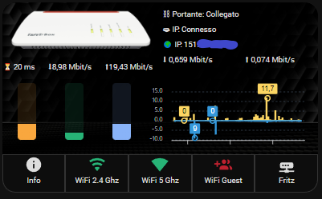
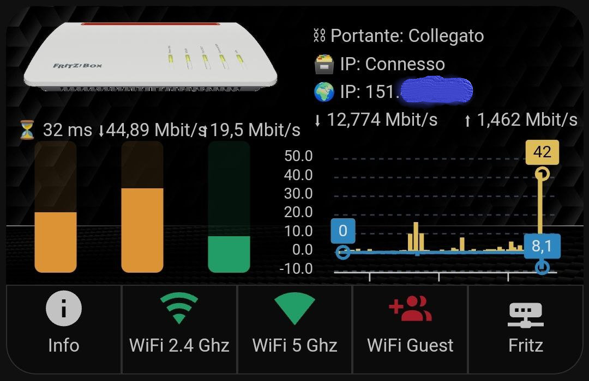
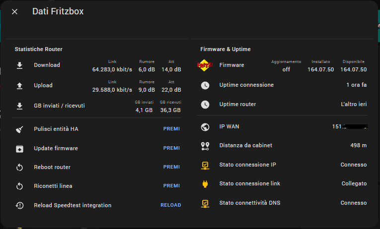
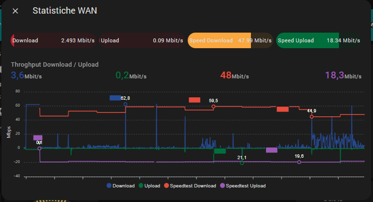
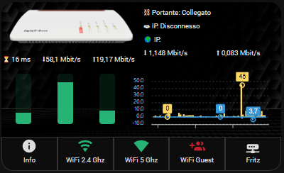
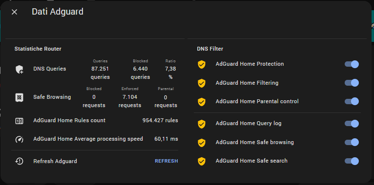

$$\textbf{\color{lightgreen} \huge Network + Adguard}$$

<p align="center"> 🔥 <b>Pacchetto AUTO CONFIGURANTE</b> 🔥 </p>

| Sommario |
| :---: |
| [Introduzione](#introduzione) |
| [Prerequisiti](#prerequisiti) | 
| [Dispositivi](#dispositivi) | 
| [Funzionamento](#funzionamento) | 
| [User interface](#user-interface) |
| [Installazione](#installazione) | 
| [Configurazione](#configurazione) |
| [Conclusioni](#conclusioni) |

**Paragrafi obbligatori:**
- [x] [Prerequisiti](#prerequisiti)
- [x] [Installazione](#installazione)
- [x] [Configurazione](#configurazione)

**Ti piace questo package? Lascia una stella su Github e supportami per realizzarne altri!** <a href="https://www.buymeacoffee.com/jumping"></a>

[![Websitebadge]][website] [![Forum][forumbadge]][forum] [![telegrambadge]][telegram] [![facebookbadge]][facebook] 

## Introduzione

L'articolo ha l'obiettivo di offrire una interfaccia piacevole per rendere visibili i dati di funzionamento della propria connessione internet e LAN usufruita tramite apparati Fritzbox ma adattabile per altri apparati diversi, e una semplice interfaccia per l'utilizzo di AdGuard, quindi avremo:
1. un package per le principali entità
2. blueprint per il setup e le notifiche
3. una card Lovelace con grafici completi ed informazioni di funzionamento.

**🔥E novità assoluta, il tutto sarà auto-configurante senza necessità di scrivere neanche una riga di YAML** 🔥


Anche per queste configurazioni saranno usati alcuni elementi grafici custom ricchi di funzionalità come [Button Card](https://github.com/custom-cards/button-card) ed [ApexChart Card](https://github.com/RomRider/apexcharts-card) che oramai sono diventati dei veri e propri classici delle interfacce sviluppate per Home Assistant e introdurremo ulteriori elementi sia a livello di dati disponibili che a livello di grafica.

Riepiloghiamo i punti di forza di questo pacchetto sono:
1. Adattabile per l'uso su tablet, smartphone, PC;
2. Utilizzo di script di auto-configurazione
3. Versioni grafica Locelave unificata adata per dashboard "_YAML_" e "_storage_", vedi [Dashboard](https://www.home-assistant.io/dashboards/dashboards/);
4. Riduzione del numero di componenti custom necessari;


## Prerequisiti 

Per poter utilizzare il packages occorrono alcune card e alcune configurazioni abbastanza comuni, le card e i custom sono disponibili sul community store [HACS](https://hacs.xyz/) , sul sito [HassioHelp.eu](https://hassiohelp.eu) sono presenti numerose guide, prestate particolare attenzione alla data di rilascio della guida, alcune sono datate e potrebbero essere da ricontrollare, in questo caso il gruppo Telegram [HassioHelp](https://t.me/HassioHelp) è un validissimo aiuto.

| Card/Custom | Uso |
| :---: | --- |
| **[Button Card](https://github.com/custom-cards/button-card)** | Obbligatorio |
| **[ApexChart Card](https://github.com/RomRider/apexcharts-card)** | Obbligatorio |
| **[Browser Mod](https://github.com/thomasloven/hass-browser_mod)** | Obbligatorio |
| **[Card Mod](https://github.com/thomasloven/lovelace-card-mod)** | Obbligatorio |
| **[Layout Card](https://github.com/thomasloven/lovelace-layout-card)** | Usato ma non indispensabile |
| **[Bar Card](https://github.com/custom-cards/bar-card)** | Usato ma non indispensabile |
| **[Multiple Entity Row](https://github.com/benct/lovelace-multiple-entity-row)** | Usato ma non indispensabile |

L'utilizzo delle card _non indispensabili_ permette una migliore visualizzazione delle informazioni soprattutto con i dispositivi smartphone ma nulla vieta di poterle rimuovere utilizzando dei layout più scomodi ma comunque fruibili (questo vale per la Layout Card e la Multiple Entity Row). La rimozione dei componenti custom e dl relativo adattamento del codice YAML è lasciato al lettore "evoluto" in grado di procedere in autonomia.

| Integrazioni | Uso | Installazione |
| :---: | --- | --- |
| **[AVM FRITZ!Box Tools](https://www.home-assistant.io/integrations/fritz/)** | Obbligatorio * | [Installa ora](https://my.home-assistant.io/redirect/config_flow_start?domain=fritz) ☎ |
| **[AdGuard Home](https://www.home-assistant.io/integrations/adguard/)** | Consigliato| [Installa ora](https://my.home-assistant.io/redirect/config_flow_start?domain=adguard) 🧒|
| **[Speedtest.net](https://www.home-assistant.io/integrations/speedtestdotnet)** | Consigliato | [Installa ora](https://my.home-assistant.io/redirect/config_flow_start?domain=speedtestdotnet) 🛑 |

Per quanto riguarda le integrazioni ufficiali ho inserito solo quella relativa al Fritzbox come obbligatoria ma non è del tutto vero: l'utente esperto sarà in grado di adattare il package in maniera più o meno parziale al proprio apparato modem/router che espone qualche dato verso la propria istanza di Home Assistant. Per l'installazione basta seguire i link della documentazione ufficiale di Home Assistant e procedere con le indicazioni, per quanto riguarda **AdGuard Home** occorre anche installare e configurare l'addon o il container.

| Configurazioni obbligatorie |
| :---: |

Per poter procedere con l'installazione del package ci sono alcuni passi da effettuare:
* abilitare i packages come descritto qui: [Packages](https://www.home-assistant.io/docs/configuration/packages/);
* configurare Home Assistant per avere i sensori di tempo e di data come spiegato qui: [Time & Date](https://www.home-assistant.io/integrations/time_date/) o nelle guide [HassioHelp](https://hassiohelp.eu);
* impostazione dei servizi di notifica: ad esempio [Telegram](https://www.home-assistant.io/integrations/telegram/), [Google](https://www.home-assistant.io/integrations/google_assistant/), [Mobile App](https://companion.home-assistant.io/) la scelta migliore rimane sempre l'uso del [Centro Notifiche](https://github.com/caiosweet/Package-Notification-HUB-AppDaemon) che centralizza la configurazione di tutti i servizi di notifica.
* configurare il ***blueprint*** ad hoc.

| Guide Hassiohelp |
| :---: |

Ecco alcune guide pubblicate da [HassioHelp.eu](https://hassiohelp.eu) che sicuramente sono meno aggiornate della documentazione ufficiale ma restano valide: 
* [Packages](https://hassiohelp.eu/2018/11/30/package-configurazione/)
* [ESPHome](https://hassiohelp.eu/2019/06/09/esphome/)
* [HACS](https://hassiohelp.eu/2019/10/06/hacs-guida-allinstallazione/)
* [Google](https://hassiohelp.eu/2018/11/29/google-home/)
* [Alexa](https://hassiohelp.eu/2019/12/11/alexa-su-home-assistant-gratis/)
* [Centro Notifiche](https://hassiohelp.eu/2020/11/09/centro-notifiche-3-0-appdaemon/)
* [Animazioni CSS](https://hassiohelp.eu/2020/04/09/css-lovelace/)

## Dispositivi

In questo package non ci sono dispositivi particolari a cui fare riferimento, oltre al modem/ruoter/AP [AVM Fritzbox](https://it.avm.de/prodotti/fritzbox/) supportato dall'integrazione ufficiale di Home Assistant.

## Funzionamento
| Fritzbox |
| :---: |

Non starò a descrivere qui le qualità e i limiti di questi apparati, c'è chi li ama e chi li odia, restano comunque un discreto prodotto consumer
con prestazioni più che buone in condizioni di utilizzo "normali". Il package sfrutta l'integrazione ufficiale che mette a disposizioni un grande numero di numero di entità:
* **Device tracker** - rilevamento della presenza relativo ai dispositivi collegati.
* **Binary sensor** - stato della connettività.
* **Button** - per effettuare riavvii, riconnessioni, update del firmware.
* **Sensor** - espongono dati come indirizzo IP esterno, tempo di attività e monitor di dei parametri di rete.
* **Switch** - deviazione delle chiamate, port forwarding, controllo parentale e reti Wi-Fi.
* **Update** - stato del firmware del dispositivo.

| Speedtest.net|
| :---: |

L'integrazione è il classico [Speedtest®](https://www.speedtest.net/about) di Ookla®, a cui si rimanda per ulteriori info, che effettua un test per misurare le prestazioni raggiunte dalla propria connessione Internet, i dati restituiti dall'integrazione sono tre sensori:
* **Ping**: tempo di reazione in ms (millisecondi) della tua connessione (quanto velocemente ricevi una risposta dopo aver inviato una richiesta).
* **Download**: la velocità di download, quindi da Internet verso "casa" (Mbit/s, megabit al secondo).
* **Upload**: la velocità di upload, quindi da "casa" verso Internet (Mbit/s, megabit al secondo).

L'integrazione di default esegue il test di "velocità" ogni ora ma è possibile disabilitare il comportamento di default e utilizzare un intervallo tra test completamente "customizzabile". Il motivo per utilizzare questa integrazione è quello di avere un andamento nel tempo dei valori di picco (UP / DOWN) della propria connessione e sarà utilizzato nell'apposita card. Il team di HA sconsiglia di usare questa integrazione nel caso di Raspberry Pi3, direi che è una buonissima idea 🙂.

*  [Speedtest HA Integration](https://my.home-assistant.io/redirect/config_flow_start?domain=speedtestdotnet)

<br>

| AdGuard Home|
| :---: |

AdGuard Home è un server DNS che blocca pubblicità e tracker a livello di rete e permette il controllo parentale (blocco dei contenuti per adulti). L'integrazione di AdGuard ti consente di controllare e monitorare la tua istanza di AdGuard Home in Home Assistant.
I dati esposti riguardano sia sensori che evidenziano il numero di siti bloccati di query DNS etc, e una serie di entità switch per abilitare/disabilitare le funzionalità di AdGuard, andiamo ore un po' nel dettaglio.
A differenza dei tradizionali ad blocker che funzionano su un dispositivo specifico o anche in un browser specifico, AdGuard Home, una volta configurato, coprirà TUTTI i dispositivi nella rete Wi-Fi o LAN cablata domestica e non sarà necessario installare software lato client su ogni singolo dispositivo. Benché ci siano diverse modalità di uso di AdGuard (on premise oppure on cloud) ci sentiamo di consigliare la modalità di più semplice quindi di utilizzo come container/addon oppure su un apparecchio separato (ad esempio Raspberry Pi) e con funzionalità di [DNS](https://it.wikipedia.org/wiki/Domain_Name_System) dei tuoi dispositivi domestici e PC; vediamo ora le principali funzionalità:

* **Blocca dei domini utilizzando filtri e file host** - Abilita l'applicazione delle regole di blocco. Si possono configurare nella scheda **Filtri**.
* **Servizio web di sicurezza della navigazione** - Controlla le richieste rispetto agli elenchi di domini pericolosi noti. Blocca quelli dannosi e di phishing.
* **Controllo dei genitori (_Parental Control_)** - Controlla se le richieste contengono domini di siti web per adulti e li blocca.
* **Ricerca sicura (_Safe search_)** - Rimuove materiali osceni dai risultati di ricerca nei motori di ricerca.

Per la configurazione di dettaglio si trova tantissimo materiale on-line, per cui rimandiamo per i dettagli alle numerose guide disponibili su Internet, anche se si può dire che per le migliori prestazioni e la più bassa latenza sulle richieste DNS, AdGuard Home dovrebbe essere il tuo principale resolver DNS nella tua catena DNS e ___quindi configurato nelle impostazione relative al DNS nel proprio apparato router (ad esempio)___.
Lascio di seguito le pagine relative al'addon della community e dell'integrazione ufficiale:

*  [AdGuard Home ADDON](https://github.com/hassio-addons/addon-adguard-home)
*  [AdGuard Home HA Integration](https://my.home-assistant.io/redirect/config_flow_start?domain=adguard)


---

Il package e la relativa card espongono una serie di dati, funzionalità, grafici, proviamo a riassumerle:

**Dati**

* Dati relativi alla connessione del link fisico (aggancio della portante, margine di rumore e attenuazione della linea).
* Stima della distanza da cabinet in base ai valori di linea.
* Quantità di dati scaricati / caricati.

Ovviamente alcuni valori (come rumore ed attenuazione) non hanno senso se parliamo di connessioni [FTTH](https://it.wikipedia.org/wiki/FTTx) ma solo per connessioni [ADSL](https://it.wikipedia.org/wiki/ADSL) / [FTTC](https://it.wikipedia.org/wiki/FTTx).

**Grafici**

* Grafico X-Y dei combinato dei dati Upload / Download misurati da Speedtest e dei dati esposti dall'integrazione Fritzbox
* Grafico a istogramma dei valori esposti da Speedtest.net

**Funzionalità presenti**

* Dati di performance della connessione Internet
* Attivazione / disattivazione di Wifi 2,4Ghz / 5Ghz / Guest Network
* Riavvii, riconnessioni, update del firmware.
* Notifiche con Telegram / Companion App / Alexa / Google oppure con l'ottimo [Centro Notifiche](https://github.com/caiosweet/Package-Notification-HUB-AppDaemon) realizzato con [app](https://github.com/jumping2000/notifier) in Python.

<br>

$$\textbf{\color{red} \normalsize NOTA BENE} $$

Il package è piuttosto generale quindi è possibile che alcuni dispositivi espongano tramite integrazione certe entità e non altre, occorre un po' di buon senso e cancellare le parti YAML non necessarie.

<!-- Per evitare l'uso inutile di entità per configurare alcune aspetti "statici" o comunque poco variabili, relativi al funzionamento, abbiamo preferito usare gli [anchor](https://github.com/thomasloven/hass-config/wiki/Misc-tricks) impostabili nella sezione **"IMPOSTAZIONI DEL PACKAGES"**.
Al contrario gli aspetti di configurazione che sono più soggetti a variazioni sono configurabili dalla card.  Per i **template sensor** sarà comunque necessario personalizzare leggermente il codice visto che non è possibile usare gli anchor, ma in questo caso è chiaramente indicato. -->

## User Interface

<table align="center">
	<tr>
	  <th><center> 🖥 Desktop 🖥<center></th>
    <th><center>📱 Mobile 🔋<center></th>
	</tr>
  <tr>
      <td><div align=center></div></td>
      <td><div align=center></div></td>
  </tr>
</table>

La card è, in sostanza, una _custom button-card_ con funzionalità di _container_ che al suo interno contiene due importanti sezioni:
* la _parte superiore_ è costituita da una _picture-elements card_
* la _parte inferiore_ è costituita da una fila orizzontale di 5 bottoni a loro volta realizzati con _custom button-card_

La ***picture-elements*** card ha la funzione di _contenitore_ sia per elementi grafici che informazioni testuali:
* **sulla parte sinistra in alto** è presente l'immagine grafica della del router Fritzbox, i CSS presenti nella configurazione fanno in modo che in mancanza di connessione si accendano dei LED rosi di stato. Cliccando sull'immagine si apre la card relativa ad AdGuard Home.
* **nella parte sinistra in basso** sono presenti i grafici a barre per i sensori Speedtest.net, per chi non volesse usare questa integrazione è possibile utilizzare i dati esposti dall'integrazione Fritzbox per evidenziare as esempio i dati di aggancio della portante.
* **in alto a destra** troviamo le informazioni testuali sulla connessione
* **nella parte destra in basso** è collocato il grafico che mostra l'andamento reale di upload (in blu) e download (giallo) dei dati da Internet.

La sezione orizzontale di bottoni in basso ("***button container***") presenta le seguenti informazioni:

| Bottone | Cosa fa |
| :---: | --- |
| **Info** | cliccando si apre una finestra con le informazioni di dettaglio relative alla connessione e i button per riavvio, riconnessione etc |
| **2.4Ghz** / **5Ghz**  | cliccando sui due bottoni si abilitano gli AP/connessioni indicate |
| **Guest** | bottone che abilita la rete guest
| **Fritz** | bottone che con il tocco singolo apre la finestra con i grafici |
| **Immagine del Fritz** | cliccando sull'immagine si apre il pop-up di AdGuard |

Come detto la card è adattabile al dispositivo usato e al suo orientamento, non si tratta una card _responsive_ ma si è cercato di rendere la fruizione buona sia su smartphone che su PC o tablet.

<table align="center">
	<tr>
	    <th><center>🎫 Info Card 🎫</center></th>
      <th><center>⬆ Throughput Card ⬇</th>
	</tr>
    <tr>
        <td><div align=center></div></td>
        <td><div align=center></div></td>
    </tr>
	<tr>
	    <th><center>⚠ Problemi di connessione ⚠</center></th>
      <th><center>👮 AdGuard 🕵️‍♀️</center></th>
	</tr>
    <tr>
        <td><div align=center></div></td>
        <td><div align=center></div></td>
    </tr>
</table>


## Installazione
| Download |
| :---: |

[Github](https://github.com/jumping2000/ha-packages/tree/main/elettrodomestici_2023) permette di effettuare il completo download dei file che costituiscono il pacchetto, quindi file yaml e immagini. Basta cliccare sul pulsante "verde" e si scaricherà un file zip con tutti i packages presenti.

In alternativa per i packages relativi ad **Elettrodomestici Smart 2023** è possibile effettuare il download per "release":
* [Release Download](https://github.com/jumping2000/ha-packages/releases)

<br>
<table align="center">
	<tr>
	    <th><center>🎫 Github Download 🎫</center></th>
        <th><center>🎫 Release Download 🎫</center></th>
	</tr>
  <tr>
      <td><div align=center></div></td>
      <td><div align=center></div></td>
  </tr>
</table>


| Struttura dei file |
| :---: |

La struttura dei file è rappresentata di seguito, quindi occorre **rispettare la posizione dei file nel filesystem come da schema sottostante**, in alternativa l'utente esperto può riposizionare i files nella maniera che più preferisce. 

La card Lovelace è unica ed è disponibile sia per chi usa la modalità [YAML o storage](https://www.home-assistant.io/dashboards/dashboards/) (***card_router.yaml***).

**NOTA**:
Saranno presenti due cartelle _autoconfig_, una per PC (_autoconfig_x86_64_) e una per Raspberry (_autoconfig_rpi_).


```bash
.
├── addons/
├── backup/
│
├── config/
│   │
│   ├── lovelace/
│   │   └── card_elettrodomestici/
│   │       └── card_router.yaml
|   |
│   ├── packages/
│   │   ├── autoconfig/
│   │   │   ├── pyarmor_runtime_000000/
│   │   │   └─── auto_config.py
│   │   ├── keys.txt
│   │   └── elettrodomestici/
│   │       └── network.yaml
│   │
│   ├── www/
│   │   └── hassiohelp/
│   │       └── pkg_elettrodomestici/
│   │           ├── router.png
│   │           ├── led_1.png
│   │           ├── led_2.png
│   │           ├── sfondo_black.png
│   │           ├── sfondo_white.png
│   │           ├── sfondo_gray.png
│   │           └── sfondo_gray2.png
│   │ 
│   ├── home-assistant.log
│   └── secret.yaml
├── share/
└── ssl/
```

## Configurazione
| Blueprint |
| :---: |

Lanciare il blueprint [Network notification](https://github.com/jumping2000/ha-templates/tree/main/blueprints/cn_network):
* impostare le entità richieste relative all'integrazione FritzBox;
* impostare le modalità di notifica, il blueprint funziona sia con il ***Centro Notifiche*** che senza;
* nel link precedente trovi la descrizione delle funzionalità offerte.

[](https://my.home-assistant.io/redirect/blueprint_import/?blueprint_url=https%3A%2F%2Fgithub.com%2Fjumping2000%2Fha-templates%2Fblob%2Fmain%2Fblueprints%2Fcn_network%2Fcn_network.yaml)

<br>

| Impostazioni Package |
| :---: |

I passi di configurazione per poter utilizzare questo package, sono veramente pochi grazie allo script auto-configurante:
* scaricare i files necessari e inserirli nelle cartelle di HA come previsto nel paragrafo "_Struttura dei file_", in particolare:
  * la cartella _autoconfig_ e _keys_network.txt_ in _packages_
  * _network.yaml_ in _packages/elettrodomestici_
  * _card_router.yaml_ in _lovelace/card_elettrodomestici_
* rinominare _keys_network.txt_ in _keys.txt_ (**IMPORTANTE**)
* lanciare lo script di configurazione _auto_config.py_ attraverso la CLI (Command Line Interface) messa a disposizione dall'[addon SSH](https://github.com/hassio-addons/addon-ssh) oppure da CLI del container di Home Assistant (*ATTENZIONE* l'addon core-ssh non è adatto, occorre usare obbligatoriamente l'addon nel link):

**NOTA:** Se non riesci a lanciare i comandi sottostanti dal'addon SSH, utilizza nella conf dell'addon l'username ***root***, potrai ripristinare il precedente username alla fine della configurazione.

```bash

/config/packages# chmod 744 autoconfig_x86_64/auto_config.py
/config/packages# python autoconfig_x86_64/auto_config.py -v

```

oppure per Raspberry:

```bash
/config/packages# chmod 744 autoconfig_rpi/auto_config.py
/config/packages# python autoconfig_rpi/auto_config.py -v

```

dove ***/config/packages#*** è il path all'interno del filesystem del container.

<br>

* verificare che l'operazione sia andata a buon fine senza errori (_controllare sempre il log_);
* controllare package e card con un editor di testo e verificare che non ci siano tag "**ENTITA' NON NEL BLUEPRINT**", nel caso provvedere a cancellare o cambiare il blueprint inserendo l'entità necessaria (in questo package è da monitorare attentamente il sensore "VDSL distance" che non è significativo per connessioni FTTH);
* finiti questi passaggi inserire la card router o nella propria configurazione Lovelace in YAML oppure nella propria interfaccia costruita tramite UI come di seguito riportato;
* riavviare Home Assistant;
* dopo il riavvio di HA controllare che non ci siano errori nel log.

***Avvertenze***: 
1. ricordarsi di effettuare l'avvio dello script subito dopo il completamento del blueprint.
2. se per qualche motivo avete cambiato o volete cambiare i percorsi standard è possibile utilizzare delle opzioni nella sintassi dello script:
    * ***-a*** : per cambiare il percorso completo del file _automations.yaml_
    * ***-c*** : per variare il percorso completo della card
    * ***-p*** : per variare il percorso completo del package
    * ***-k*** : per variare il percorso completo del file _keys.txt_

| Lovelace - Storage |
| :---: |

Chi usa questa modalità potrà caricare l'intero file di configurazione dell'interfaccia grafica nella UI, ***dopo aver completato i passi precedenti***, e variare sempre da UI gli aspetti che più interessano.

**NOTA**:
**La card prevede gli elementi grafici per tutte le integrazioni (Speedtest, Adguard, Fritz), nel caso ad esempio non si voglia usare Speedtest occorre cancellare a mano dalla card tutta la parte relativa. E' consigliabile effettuare l'operazione subito dopo aver lanciato lo script di autoconfigurazione.**

<br>

<table align="center">
	<tr>
	    <th><center>🚀 Modalità UI storage 🚀</center></th>
	</tr>
  <tr>
      <td><div align=center></div></td>
  </tr>
</table>

Per quanto riguarda le impostazioni grafiche è possibile agire sul proprio "tema" del [Frontend](https://www.home-assistant.io/integrations/frontend/) oppure scegliere tra i vari **sfondi presenti** e su alcuni parametri relativi alla parte inferiore realizzata con button-card, in particolare:
1. raggio del bordo
2. colore del bordo
3. colore di background
4. altezza dei button inferiori


<!-- Il codice da modificare è il seguente, nella parte "_variables_"; nulla vieta, nel caso si voglia standardizzare le card, di riportare queste configurazioni in un ***button template*** e/o andare a modificare il proprio tema.

```yaml
              ###########################################################
              ## BOTTONI IN BASSO
              ###########################################################
              ### 1 ###
              - type: custom:button-card
                template: device_button_vertical_icon
                name: Info
                icon: mdi:information
                variables:
                  border_radius: 0px 0px 0px 0px
                  border_color: '#333333'
                  button_height: 60px
                  button_background: '#0d0d0d'
-->
<br>

| Alcune considerazioni |
| :---: |

Per il calcolo della distanza dal cabinet nel caso di connettività basta su FTTC - VDSL2 riportiamo di seguito la formula utilizzata:


```bash
A = k * l * sqrt(f)
```
dove _A_ è l'attenuazione in dB ad una certa frequenza _f_, _k_ è una costante dipendente dalla tipologia di cavo, _l_ è la lunghezza del cavo.

Per quanto riguarda lo script python, esso effettua una serie di operazioni di _"ricerca e sostituzione"_ all'interno del container, quindi il suo utilizzo è assolutamente sicuro: nel caso di problemi basterà cancellare lo script e riavviare HA. 

## Conclusioni
Con questo package abbiamo visto come combinare insieme diversi elementi:
* blueprint per le notifiche degli eventi relativi alla propria connessione domestica
* una grafica accattivante con alcuni effetti visuali.
* l'utilizzo di AdGuard
* **la grande novità della funzionalità di auto-configurazione!!**

Il risultato sembra piacevole, lasciate pure le vostre impressioni sui nostri canali social.

| Ispirazione e ringraziamenti |
| :---: |

Tutti i  nostri "follower" 😄

| Supporto |
| :---: |

**Ti piace questo package? Lascia una ⭐ su Github e supportami per realizzarne altri!** <a href="https://www.buymeacoffee.com/jumping"></a>

[![Websitebadge]][website] [![Forum][forumbadge]][forum] [![telegrambadge]][telegram] [![facebookbadge]][facebook] 

<!-- ✨ _special_ ✨ -->
[website]: https://hassiohelp.eu/
[Websitebadge]: https://img.shields.io/website?down_message=Offline&label=HassioHelp&logoColor=blue&up_message=Online&url=https%3A%2F%2Fhassiohelp.eu

[telegram]: https://t.me/HassioHelp
[telegrambadge]: https://img.shields.io/badge/Chat-Telegram-blue?logo=Telegram

[facebook]: https://www.facebook.com/groups/2062381507393179/
[facebookbadge]: https://img.shields.io/badge/Group-Facebook-blue?logo=Facebook

[forum]: https://forum.hassiohelp.eu/
[forumbadge]: https://img.shields.io/badge/HassioHelp-Forum-blue?logo=data:image/png;base64,iVBORw0KGgoAAAANSUhEUgAAABgAAAAYCAYAAADgdz34AAAAGXRFWHRTb2Z0d2FyZQBBZG9iZSBJbWFnZVJlYWR5ccllPAAAA0ppVFh0WE1MOmNvbS5hZG9iZS54bXAAAAAAADw/eHBhY2tldCBiZWdpbj0i77u/IiBpZD0iVzVNME1wQ2VoaUh6cmVTek5UY3prYzlkIj8%2BIDx4OnhtcG1ldGEgeG1sbnM6eD0iYWRvYmU6bnM6bWV0YS8iIHg6eG1wdGs9IkFkb2JlIFhNUCBDb3JlIDUuNS1jMDIxIDc5LjE1NTc3MiwgMjAxNC8wMS8xMy0xOTo0NDowMCAgICAgICAgIj4gPHJkZjpSREYgeG1sbnM6cmRmPSJodHRwOi8vd3d3LnczLm9yZy8xOTk5LzAyLzIyLXJkZi1zeW50YXgtbnMjIj4gPHJkZjpEZXNjcmlwdGlvbiByZGY6YWJvdXQ9IiIgeG1sbnM6eG1wTU09Imh0dHA6Ly9ucy5hZG9iZS5jb20veGFwLzEuMC9tbS8iIHhtbG5zOnN0UmVmPSJodHRwOi8vbnMuYWRvYmUuY29tL3hhcC8xLjAvc1R5cGUvUmVzb3VyY2VSZWYjIiB4bWxuczp4bXA9Imh0dHA6Ly9ucy5hZG9iZS5jb20veGFwLzEuMC8iIHhtcE1NOkRvY3VtZW50SUQ9InhtcC5kaWQ6ODcxMjY2QzY5RUIzMTFFQUEwREVGQzE4OTI4Njk5NDkiIHhtcE1NOkluc3RhbmNlSUQ9InhtcC5paWQ6ODcxMjY2QzU5RUIzMTFFQUEwREVGQzE4OTI4Njk5NDkiIHhtcDpDcmVhdG9yVG9vbD0iQWRvYmUgUGhvdG9zaG9wIENDIDIwMTQgKFdpbmRvd3MpIj4gPHhtcE1NOkRlcml2ZWRGcm9tIHN0UmVmOmluc3RhbmNlSUQ9ImFkb2JlOmRvY2lkOnBob3Rvc2hvcDo0MWVhZDAwNC05ZWFmLTExZWEtOGY3ZS1mNzQ3Zjc1MjgyNGIiIHN0UmVmOmRvY3VtZW50SUQ9ImFkb2JlOmRvY2lkOnBob3Rvc2hvcDo0MWVhZDAwNC05ZWFmLTExZWEtOGY3ZS1mNzQ3Zjc1MjgyNGIiLz4gPC9yZGY6RGVzY3JpcHRpb24%2BIDwvcmRmOlJERj4gPC94OnhtcG1ldGE%2BIDw/eHBhY2tldCBlbmQ9InIiPz4xQPr3AAADq0lEQVR42rRVW2wMURj%2Bz5lL7V27KG26KIuUEJemdalu3VN3Ei/ipSWUuIV4FB4kHrwo8VLRROJBgkYElZCi4olG4rVoROOSbTa0u7pzO/6Z2Zmd3Z2uevBn/8zsf/7zff/tnKGMMRi/pjM6/j08oKiqCm1tbTA4OAhuoqkS8KKPVjceOcgJngkfnl%2B5JiWH0pQvcfUPhULQ0dEBPp8PDBZZlqGyshLGFKG0fHHr/QfNlxnbjFp7uOcl8VVVj%2BXu9XohkUgY2NRpdJMpc5qWN5971zu7ftsWkSAX2iKLYg3NZ/t6Kxbu2Oi2x4g8IxSKSDR2tLXh2JOn3nAkKv9GAzPtyigS%2BSdV1B3sejhv09lTxTBcCXjRK9buu96%2BZG/7dUYEryK59EXWewNcza7zl%2Br237kpessC4yIITIlGGk88666OtR6VMFKmZhZY9sGsdw1ATgFU1O7et%2Brki56JVUtqsl4kl0CVUjB57vo1Tad7X4Wj9U1S0vRj8HfRSQKVC5auPN7zctqiPTs1Rz2pBV6xcOuq%2BkOPusVAeZWxDg5wl%2Bhz1vW%2BpBFMDIYXt9y%2BF6lr2a6kR7IEmipDeFYsRkVewFcTyAXcBtNMhTxCTTErUxZdu96qLW8varhFsyrnQCQOYNXU8qBp//4TH/jkHZ3UCTXFoncQGKciP1SiN1JDVY2IJwgEjq3jYMVsZgC/HSBw9RnA8CgBjmS3MkdefE638sCV0WGQk9/QXYNRicH%2B7eWwYUGpOT4oq%2Bfq0Upw4SEPVOCLnwOWp5o%2BgskfWEoZe8Qg6CGwcp7XWFVxTc0UYdlMrLmQsP8zVuQcWFNiORFCTSvRQTWQs6W101SRXE7/xiDSBeC5BKywRLx/KqbuA44TYUQS4HHfsLHEcZyhulP32zjEUwL2ACuPt24%2BR0HhnONJBA8IoRlG/4P4/%2B57FTTyC9bUMAQk8OJ9Am69VsHjC2cOJbPaU0iQn4DxrjnSwVwp4eF2XwC63uBVLCchpXgQPAiUUrM8xBwlfeqs%2Bc7JwFn//KHKtAI8IkVejFgIgY8p2etEB7cPDbF32wSE8pwx926XTx6pAcPxxmFlzIo2o/qPy84sb4JTSMb7v3qiGFhJIaAzw1wbkmh8tu4IrqKm4v347V1qmvQGKvjJjEyf7v/pX3GmrGp%2BtT73UDyRHCPLMBDKwUj801dl4P7Fwc8fh0rLwiaBrp2dN2Do%2Bxfb%2Bd%2BE2GwEe%2BEPTYaW1gNQUiKaBP9T/ggwAJik5dEKYSC3AAAAAElFTkSuQmCC

